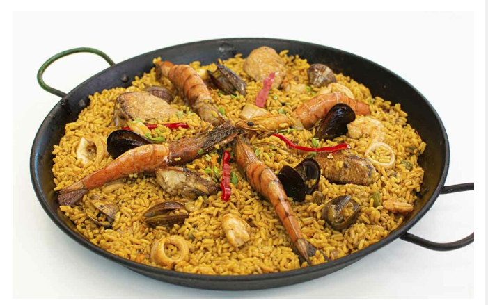

# Receta de Paella

La paella es un plato tradicional español, especialmente de la región de Valencia. Es conocida por su rico sabor y su combinación de mariscos, carnes y vegetales. A continuación, te mostramos cómo prepararla.

## Ingredientes

 * __Arroz__ (400 g)
 * __Pollo__ (300 g, troceado)
 * __Conejo__ (200 g)
 * __Gambas__ (200 g)
 * __Mejillones__ (200 g)
 * __Calamares__ (200 g, en rodajas)
 * __Pimiento rojo__ (1, cortado en tiras)
 * __Judías verdes__ (150 g)
 * __Tomate__ (2, rallados)
 * __Aceite de oliva__ (50 ml)
 * __Azafrán__ (unas hebras)
 * __Caldo de pollo o pescado__ (1litro)
 * __Sal__ al gusto
 * __Pimienta__ al gusto

## Preparación

1. __Calienta el aceite de oliva__ en una paellera grande y sofríe el pollo y el conejo hasta que estén dorados.
2. __Añade el pimiento rojo__ y las judías, cocinando hasta que estén tiernos.
3. __Agrega los calamares__ y sofríe durante unos minutos, luego añade el tomate rallado y cocina hasta que se reduzca.
4. __Incorpora el arroz__ y sofríe ligeramente. Añade las hebras de azafrán y mezcla bien.
5. __Vierte el caldo__ caliente y distribuye bien el arroz. Cocina a fuego alto durante 10 minutos.
6. __Coloca las gambas y mejillones__ sobre el arroz. Reduce el fuego y cocina otros 10 minutos o hasta que el arroz esté en su punto.
7. __Deja reposar la paella__ tapada durante 5 minutos antes de servir.

## Consejos

* Asegúrate de no remover el arroz una vez añadido el caldo para lograr la textura perfecta.
* Puedes añadir otros mariscos como almejas o langostinos para darle más sabor.

__Disfruta de tu paella casera!__

Para más detalles sobre esta receta y sus variaciones, puedes visitar [este enlace](https://www.lafallera.es/recetas/paella-valenciana/)