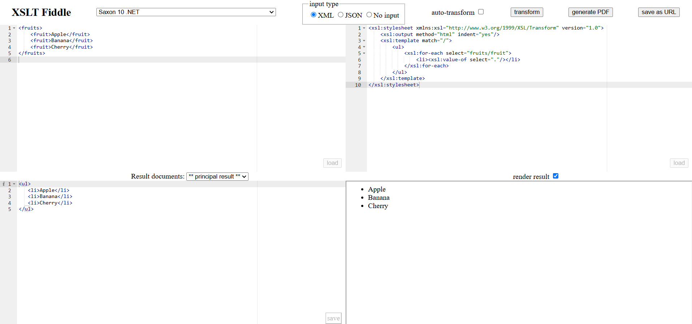

## Ejercicio 1 Generar mediante XSLT una lista HTML desordenada `<ul>` con los nombres de las frutas.

XML de entrada:

```xml
<fruits>
  <fruit>Apple</fruit>
  <fruit>Banana</fruit>
  <fruit>Cherry</fruit>
</fruits>
```

Salida:

```html
<ul>
  <li>Apple</li>
  <li>Banana</li>
  <li>Cherry</li>
</ul>
```

_Una vez creado el XSLT [`fruits.xsl`](fruits.xsl) utilizamos la herramienta online XSLT Fiddle._



_En la imagen podemos observar cómo se genera la salida esperada_