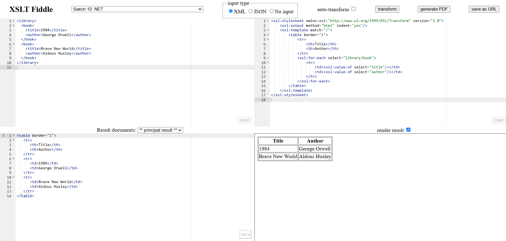

## Ejercicio 2 Crear una tabla HTML de libros con las columnas "Título" y "Autor".

XML de entrada:

```xml
<library>
  <book>
    <title>1984</title>
    <author>George Orwell</author>
  </book>
  <book>
    <title>Brave New World</title>
    <author>Aldous Huxley</author>
  </book>
</library>
```

Salida:

```html
<table border="1">
  <tr>
    <th>Title</th>
    <th>Author</th>
  </tr>
  <tr>
    <td>1984</td>
    <td>George Orwell</td>
  </tr>
  <tr>
    <td>Brave New World</td>
    <td>Aldous Huxley</td>
  </tr>
</table>
```

_Una vez creado el XSLT [`libros.xsl`](libros.xsl) utilizamos la herramienta online XSLT Fiddle._



_En la imagen podemos observar cómo se genera la salida esperada_