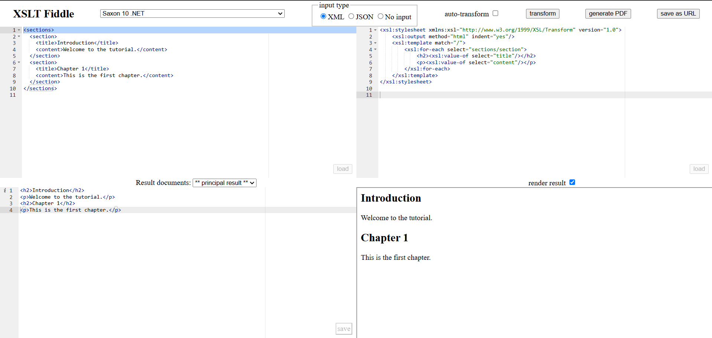

## Ejercicio 3 Crear un fichero HTML con un encabezado en cada sección. Generar encabezados `<h2>` y párrafos `<p>` para cada sección.

XML de entrada:

```xml
<sections>
  <section>
    <title>Introduction</title>
    <content>Welcome to the tutorial.</content>
  </section>
  <section>
    <title>Chapter 1</title>
    <content>This is the first chapter.</content>
  </section>
</sections>
```

Salida:

```html
<h2>Introduction</h2>
<p>Welcome to the tutorial.</p>
<h2>Chapter 1</h2>
<p>This is the first chapter.</p>
```

_Una vez creado el XSLT [`tutorial.xsl`](tutorial.xsl) utilizamos la herramienta online XSLT Fiddle._



_En la imagen podemos observar cómo se genera la salida esperada_