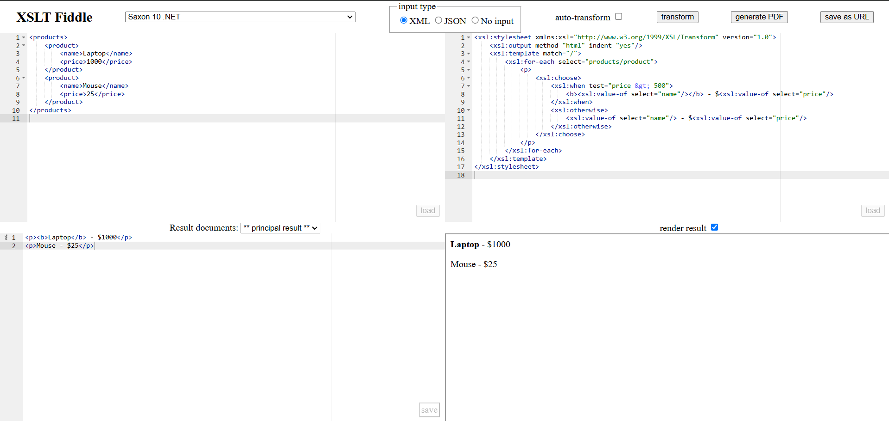

## Ejercicio 4 Generar un fichero HTML donde se resalten los productos con precio mayor a 500 en negrita `<b>`.

XML de entrada:

```xml
<products>
  <product>
    <name>Laptop</name>
    <price>1000</price>
  </product>
  <product>
    <name>Mouse</name>
    <price>25</price>
  </product>
</products>
```

Salida:

```html
<p><b>Laptop</b> - $1000</p>
<p>Mouse - $25</p>
```

_Una vez creado el XSLT [`productos.xsl`](productos.xsl) utilizamos la herramienta online XSLT Fiddle._



_En la imagen podemos observar cómo se genera la salida esperada_