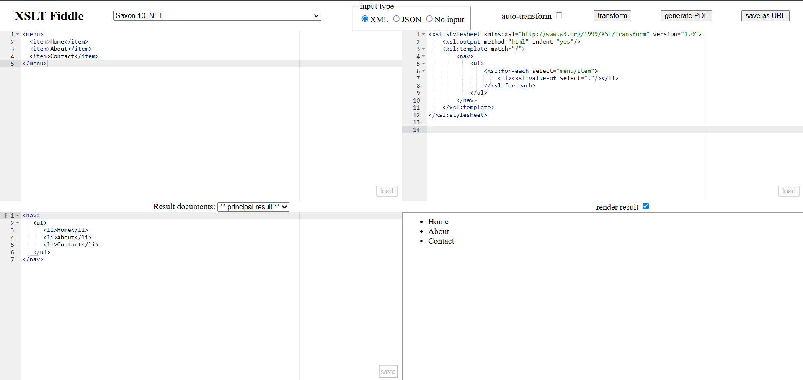

## Ejercicio 5 Generar un fichero HTML con una lista de navegación `<nav>`.

XML de entrada:

```
<menu>
  <item>Home</item>
  <item>About</item>
  <item>Contact</item>
</menu>
```

Salida:

```html
<nav>
  <ul>
    <li>Home</li>
    <li>About</li>
    <li>Contact</li>
  </ul>
</nav>
```

_Una vez creado el XSLT [`menu.xsl`](menu.xsl) utilizamos la herramienta online XSLT Fiddle._



_En la imagen podemos observar cómo se genera la salida esperada_