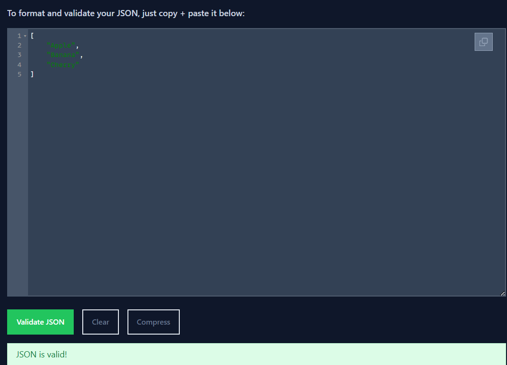

## Ejercicio 6 Generar un fichero JSON con la lista de frutas.

XML de entrada:

```xml
<fruits>
  <fruit>Apple</fruit>
  <fruit>Banana</fruit>
  <fruit>Cherry</fruit>
</fruits>
```

Salida:

```json
[
  "Apple",
  "Banana",
  "Cherry"
]
```

Si el entorno soporta XSLT 3.0, podemos usar

```
<xsl:stylesheet xmlns:xsl="http://www.w3.org/1999/XSL/Transform" version="3.0">
    <xsl:output method="json" indent="yes"/>
    <xsl:template match="/">
        <xsl:array>
            <xsl:for-each select="fruits/fruit">
                <xsl:string><xsl:value-of select="."/></xsl:string>
            </xsl:for-each>
        </xsl:array>
    </xsl:template>
</xsl:stylesheet>
```

Dado que XSLT 1.0 no tiene la capacidad de generar JSON directamente, hemos utilizado Python para completar el proceso. Mediante un script, Python ejecuta la transformación definida en el archivo XSLT sobre el archivo XML utilizando la biblioteca `lxml`. Este script genera un archivo `.json` que se ejecuta desde la terminal con `python transform.py`. Posteriormente, el archivo JSON puede validarse utilizando herramientas como [JSONLint](https://jsonlint.com/) para comprobar su formato.

