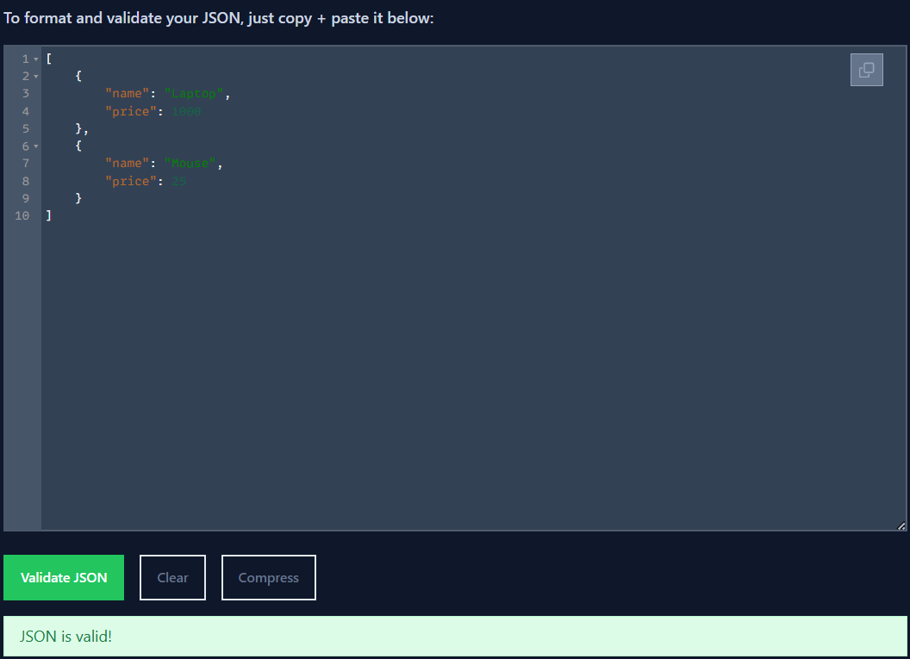

## Ejercicio 7_ Crear un fichero JSON con los productos y sus respectivos precios.

XML de entrada:

```xml
<products>
  <product>
    <name>Laptop</name>
    <price>1000</price>
  </product>
  <product>
    <name>Mouse</name>
    <price>25</price>
  </product>
</products>
```

Salida:

```json
[
  {
    "name": "Laptop",
    "price": 1000
  },
  {
    "name": "Mouse",
    "price": 25
  }
]
```

Como seguimos trabajando con XSLT 1.0, no podemos generar JSON directamente. Para resolverlo, usamos Python para completar el proceso. El archivo XSLT transforma el XML en una salida de texto estructurado que se asemeja a un JSON. Después, Python procesa esta salida y genera un archivo .json con formato válido. Ejecutamos este script desde la terminal con python transform.py, y el JSON generado puede ser validado fácilmente con herramientas como [JSONLint](https://jsonlint.com/).



_Si tuviéramos soporte para XSLT 3.0, podríamos generar JSON directamente con:_

```
<xsl:stylesheet xmlns:xsl="http://www.w3.org/1999/XSL/Transform" version="3.0">
    <xsl:output method="json" indent="yes"/>
    <xsl:template match="/">
        <xsl:array>
            <xsl:for-each select="products/product">
                <xsl:map>
                    <xsl:map-entry key="name">
                        <xsl:string><xsl:value-of select="normalize-space(name)"/></xsl:string>
                    </xsl:map-entry>
                    <xsl:map-entry key="price">
                        <xsl:number><xsl:value-of select="price"/></xsl:number>
                    </xsl:map-entry>
                </xsl:map>
            </xsl:for-each>
        </xsl:array>
    </xsl:template>
</xsl:stylesheet>

```
