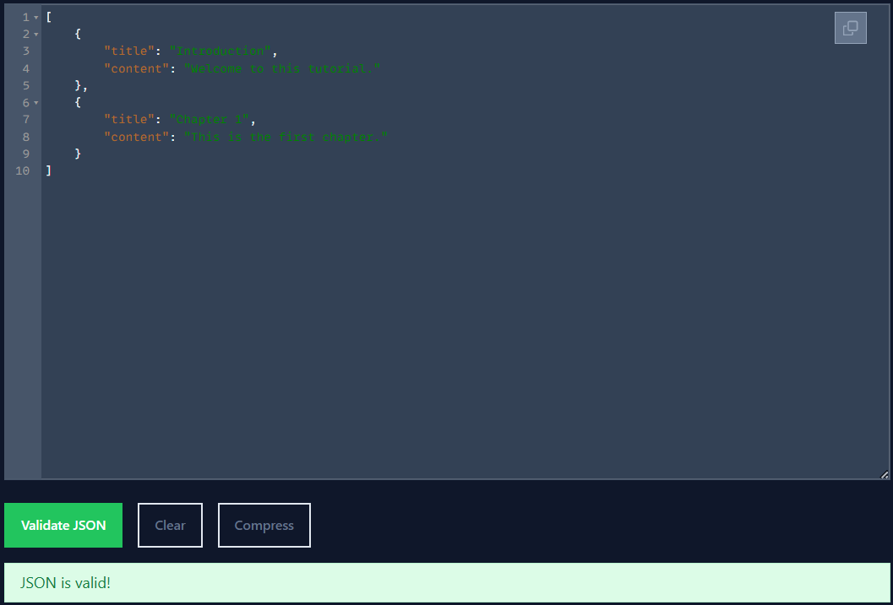

## Ejercicio 10 Crear un fichero JSON con los titulos de secciones y su contenido.

XML de entrada:

```xml
<document>
  <section>
    <title>Introduction</title>
    <content>Welcome to this tutorial.</content>
  </section>
  <section>
    <title>Chapter 1</title>
    <content>This is the first chapter.</content>
  </section>
</document>
```

Salida: 

```json
[
  {
    "title": "Introduction",
    "content": "Welcome to this tutorial."
  },
  {
    "title": "Chapter 1",
    "content": "This is the first chapter."
  }
]
```

Como seguimos trabajando con XSLT 1.0, no podemos generar JSON directamente. Para resolverlo, usamos Python para completar el proceso. El archivo XSLT transforma el XML en una salida de texto estructurado que se asemeja a un JSON. Después, Python procesa esta salida y genera un archivo .json con formato válido. Ejecutamos este script desde la terminal con python transform.py, y el JSON generado puede ser validado fácilmente con herramientas como [JSONLint](https://jsonlint.com/).



_Si tuviéramos soporte para XSLT 3.0, podríamos generar JSON directamente con:_

```
<xsl:stylesheet xmlns:xsl="http://www.w3.org/1999/XSL/Transform" version="3.0">
    <xsl:output method="json" indent="yes"/>
    <xsl:template match="/">
        <xsl:array>
            <xsl:for-each select="document/section">
                <xsl:map>
                    <xsl:map-entry key="title">
                        <xsl:string><xsl:value-of select="normalize-space(title)"/></xsl:string>
                    </xsl:map-entry>
                    <xsl:map-entry key="content">
                        <xsl:string><xsl:value-of select="normalize-space(content)"/></xsl:string>
                    </xsl:map-entry>
                </xsl:map>
            </xsl:for-each>
        </xsl:array>
    </xsl:template>
</xsl:stylesheet>
```
