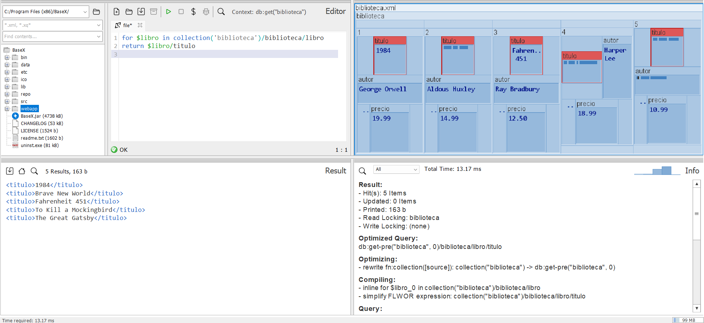
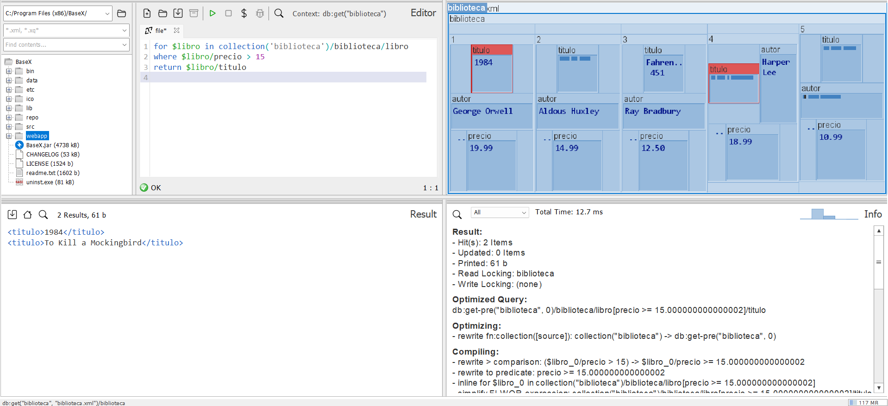
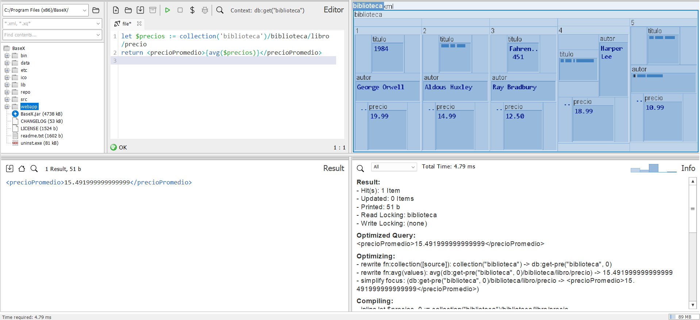
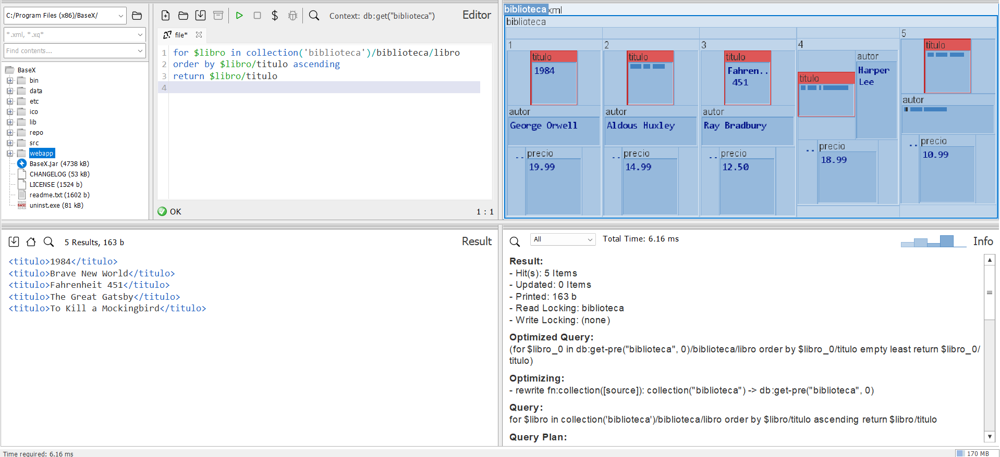
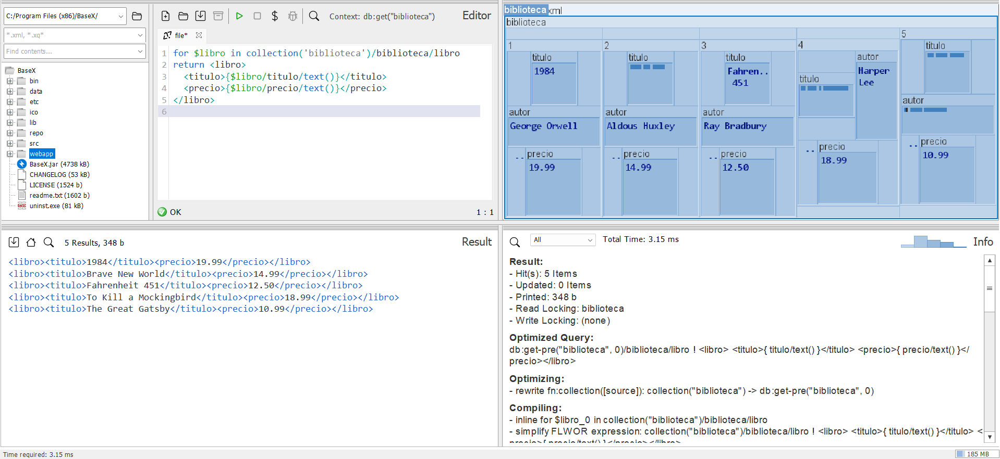
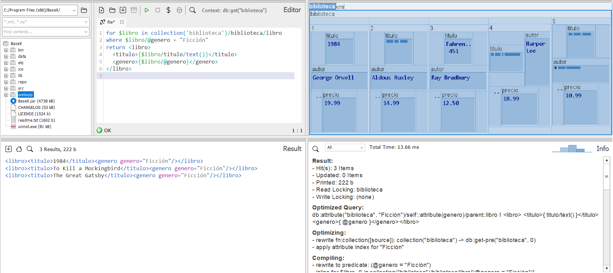
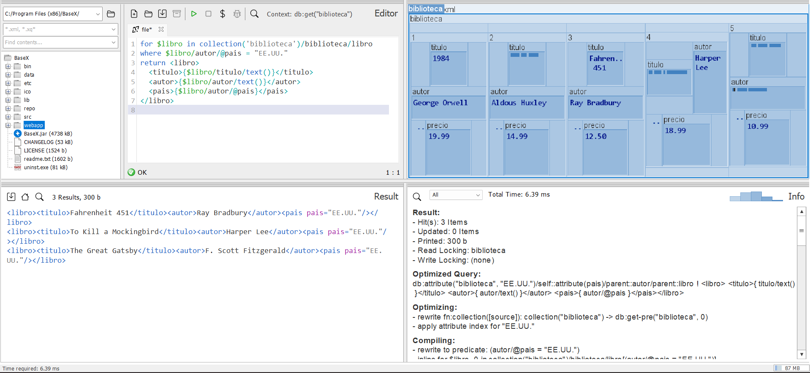
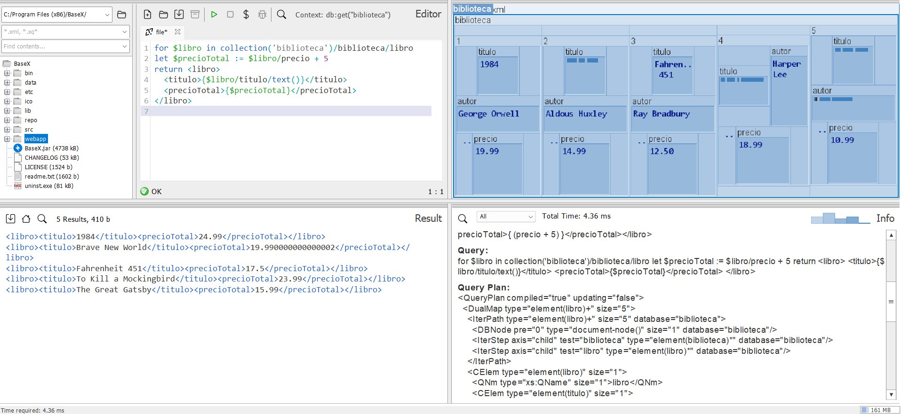
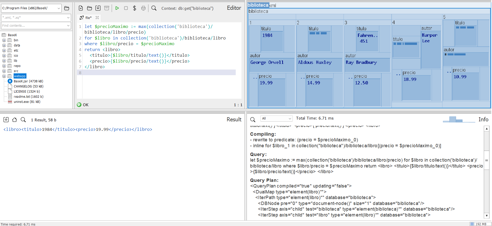

## Ejercicio 1. Archivo biblioteca.xml:

__Pregunta 1.__ _Devuelve todos los títulos de los libros._

`for $libro in collection('biblioteca')/biblioteca/libro
return $libro/titulo`

__Pregunta 2.__ _Devuelve los títulos de libros cuyo precio es mayor a 15._

`for $libro in collection('biblioteca')/biblioteca/libro
where $libro/precio > 15
return $libro/titulo`

__Pregunta 3.__ _Lista los autores y sus países de origen._

`for $libro in collection('biblioteca')/biblioteca/libro
return <autor>
  <nombre>{$libro/autor/text()}</nombre>
  <pais>{$libro/autor/@pais}</pais>
</autor>`

__Pregunta 4.__ _Calcula el precio promedio de los libros._

`let $precios := collection('biblioteca')/biblioteca/libro/precio
return <precioPromedio>{avg($precios)}</precioPromedio>`

__Pregunta 5.__ _Devuelve los títulos ordenados alfabéticamente._

`for $libro in collection('biblioteca')/biblioteca/libro
order by $libro/titulo ascending
return $libro/titulo`

__Pregunta 6.__ _Devuelve los títulos y precios de los libros en formato XML._

`for $libro in collection('biblioteca')/biblioteca/libro
return <libro>
  <titulo>{$libro/titulo/text()}</titulo>
  <precio>{$libro/precio/text()}</precio>
</libro>`

__Pregunta 7.__ _Encuentra libros del género "Ficción"._

`for $libro in collection('biblioteca')/biblioteca/libro
where $libro/@genero = "Ficción"
return <libro>
  <titulo>{$libro/titulo/text()}</titulo>
  <genero>{$libro/@genero}</genero>
</libro>`

__Pregunta 8.__ _Devuelve los libros cuyo autor sea de "EE.UU."._

`for $libro in collection('biblioteca')/biblioteca/libro
where $libro/autor/@pais = "EE.UU."
return <libro>
  <titulo>{$libro/titulo/text()}</titulo>
  <autor>{$libro/autor/text()}</autor>
  <pais>{$libro/autor/@pais}</pais>
</libro>`

__Pregunta 9.__ _Lista los libros y su precio total (precio + 5 USD de impuesto)._

`for $libro in collection('biblioteca')/biblioteca/libro
let $precioTotal := $libro/precio + 5
return <libro>
  <titulo>{$libro/titulo/text()}</titulo>
  <precioTotal>{$precioTotal}</precioTotal>
</libro>`

__Pregunta 10.__ _Devuelve el libro más caro en el catálogo._

`let $precioMaximo := max(collection('biblioteca')/biblioteca/libro/precio)
for $libro in collection('biblioteca')/biblioteca/libro
where $libro/precio = $precioMaximo
return <libro>
  <titulo>{$libro/titulo/text()}</titulo>
  <precio>{$libro/precio/text()}</precio>
</libro>`

