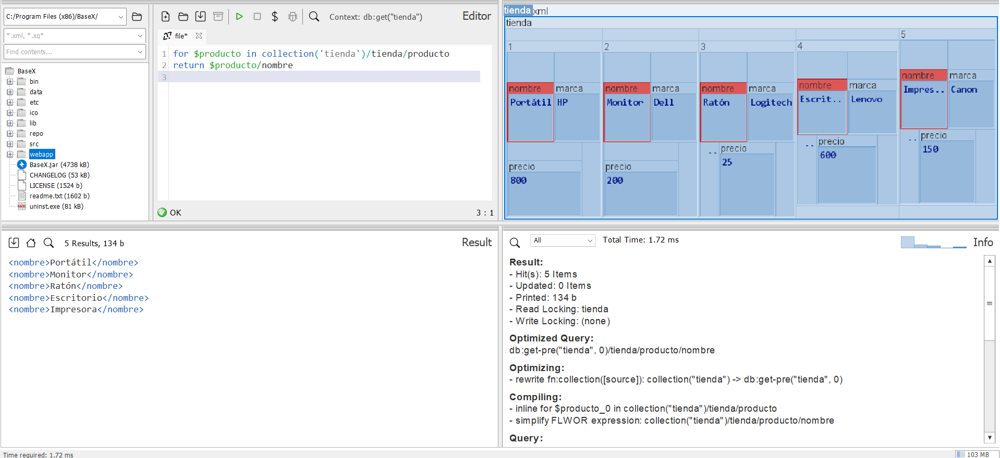
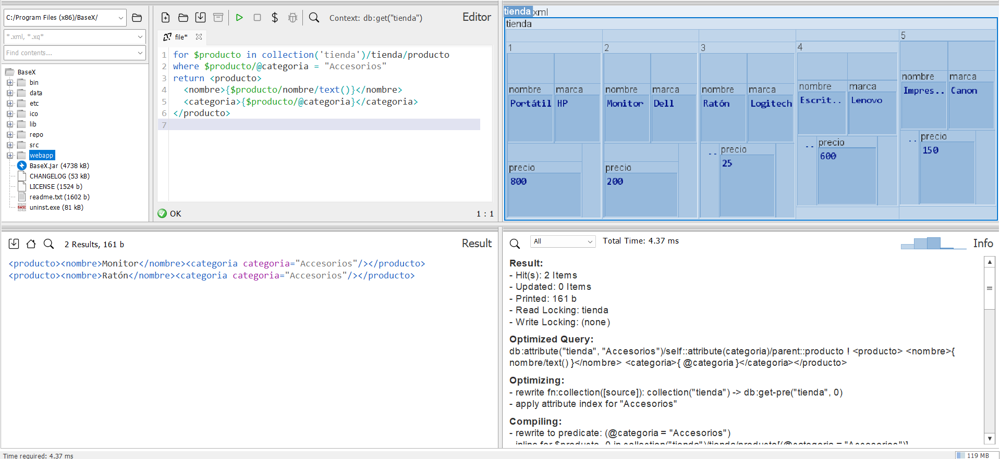
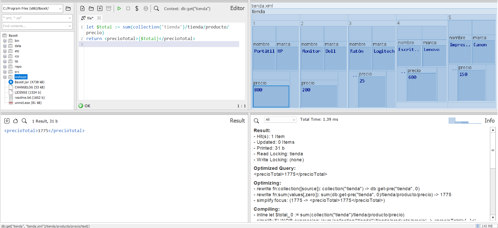
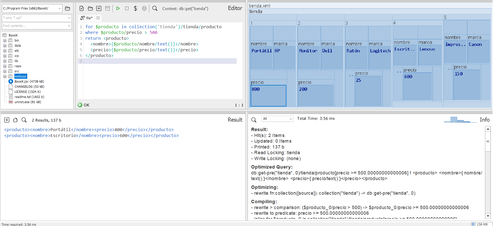
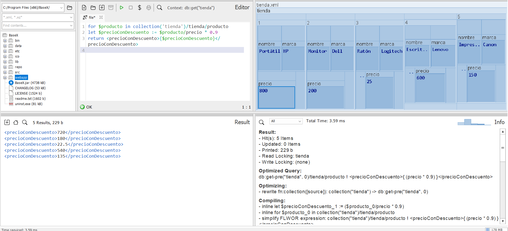
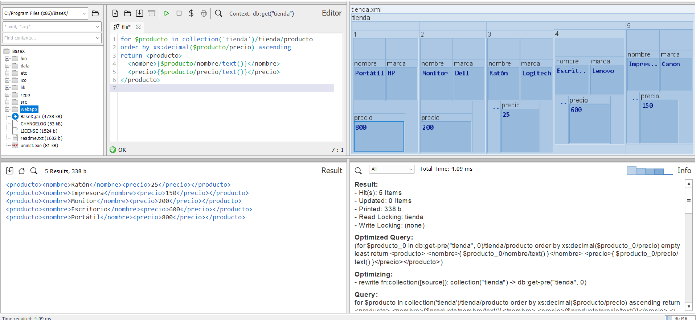
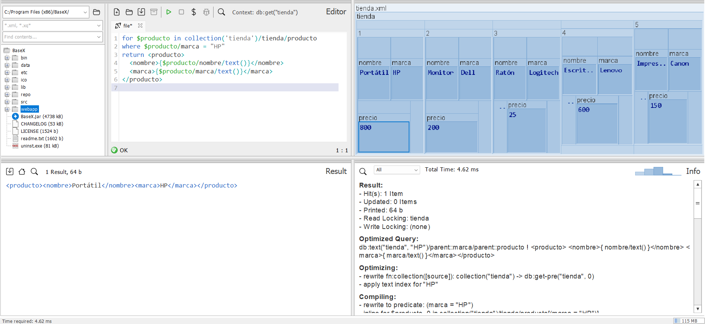
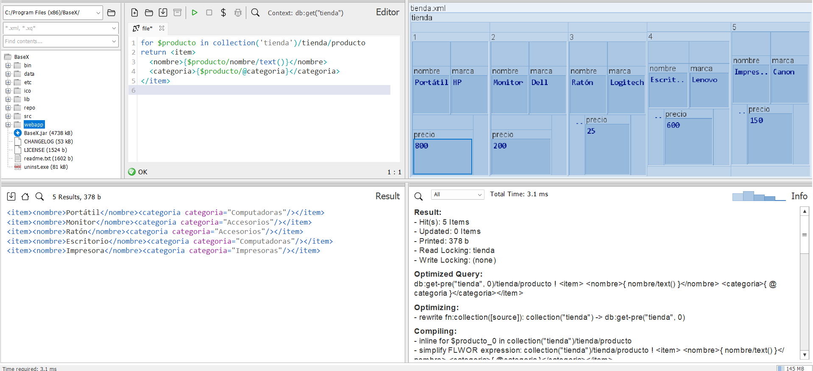
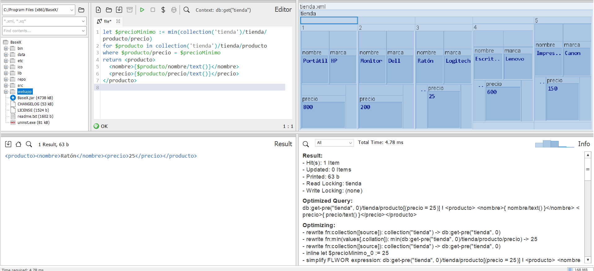
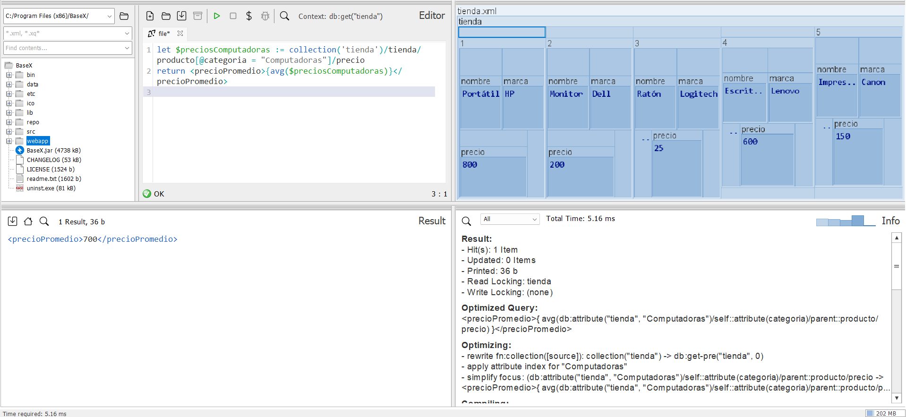

## Ejercicio 2. Archivo tienda.xml:

__Pregunta 1.__ _Devuelve los nombres de todos los productos._

`for $producto in collection('tienda')/tienda/producto
return $producto/nombre`

__Pregunta 2.__ _Devuelve los productos de la categoría "Accesorios"._

`for $producto in collection('tienda')/tienda/producto
where $producto/@categoria = "Accesorios"
return <producto>
  <nombre>{$producto/nombre/text()}</nombre>
  <categoria>{$producto/@categoria}</categoria>
</producto>`

__Pregunta 3.__ _Calcula el precio total de todos los productos._

`let $total := sum(collection('tienda')/tienda/producto/precio)
return <precioTotal>{$total}</precioTotal>`

__Pregunta 4.__ _Encuentra productos con un precio mayor a 500 USD._

`for $producto in collection('tienda')/tienda/producto
where $producto/precio > 500
return <producto>
  <nombre>{$producto/nombre/text()}</nombre>
  <precio>{$producto/precio/text()}</precio>
</producto>`

__Pregunta 5.__ _Devuelve los productos y sus precios con un descuento del 10%._

`for $producto in collection('tienda')/tienda/producto
let $precioConDescuento := $producto/precio * 0.9
return <precioConDescuento>{$precioConDescuento}</precioConDescuento>`

__Pregunta 6.__ _Lista los productos ordenados por precio de menor a mayor._

`for $producto in collection('tienda')/tienda/producto
order by xs:decimal($producto/precio) ascending
return <producto>
  <nombre>{$producto/nombre/text()}</nombre>
  <precio>{$producto/precio/text()}</precio>
</producto>`

__Pregunta 7.__ _Devuelve los productos de la marca "HP"._

`for $producto in collection('tienda')/tienda/producto
where $producto/marca = "HP"
return <producto>
  <nombre>{$producto/nombre/text()}</nombre>
  <marca>{$producto/marca/text()}</marca>
</producto>`

__Pregunta 8.__ _Devuelve los nombres y categorías de los productos como elementos <item>._

`for $producto in collection('tienda')/tienda/producto
return <item>
  <nombre>{$producto/nombre/text()}</nombre>
  <categoria>{$producto/@categoria}</categoria>
</item>`

__Pregunta 9.__ _Encuentra el producto más barato._

`let $precioMinimo := min(collection('tienda')/tienda/producto/precio)
for $producto in collection('tienda')/tienda/producto
where $producto/precio = $precioMinimo
return <producto>
  <nombre>{$producto/nombre/text()}</nombre>
  <precio>{$producto/precio/text()}</precio>
</producto>´

__Pregunta 10.__ _Calcula el precio promedio de los productos en la categoría "Computadoras"._

`let $preciosComputadoras := collection('tienda')/tienda/producto[@categoria = "Computadoras"]/precio
return <precioPromedio>{avg($preciosComputadoras)}</precioPromedio>`

