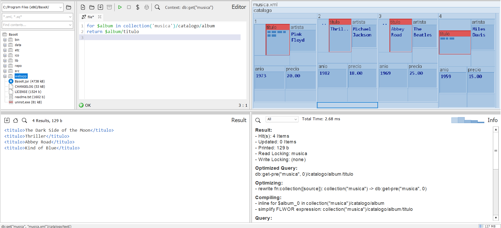
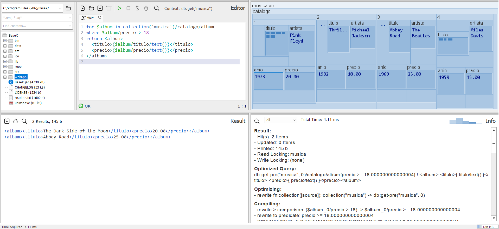
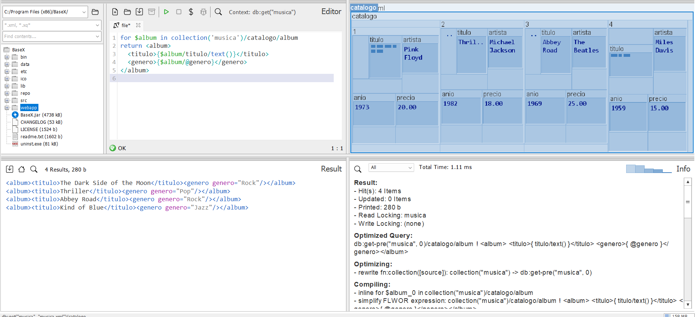
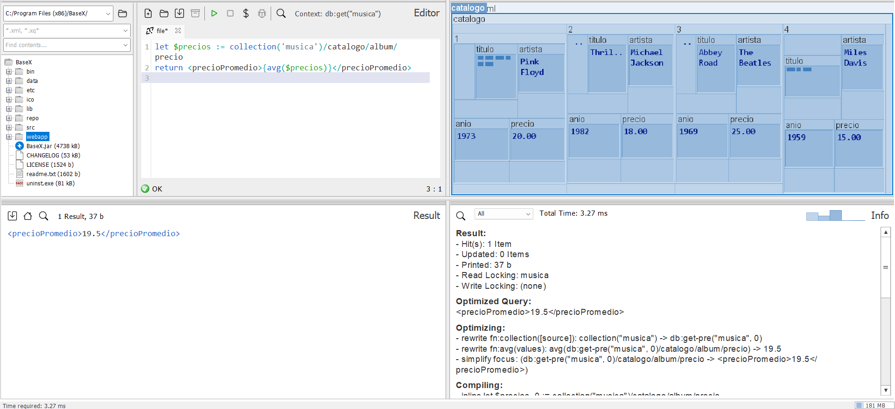
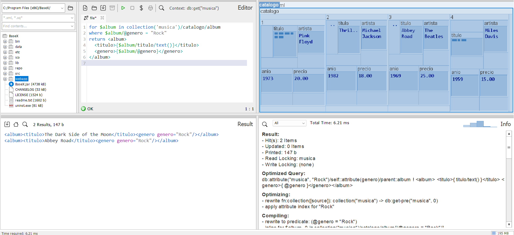
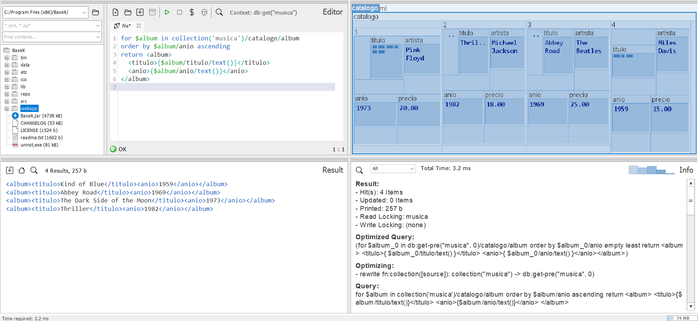
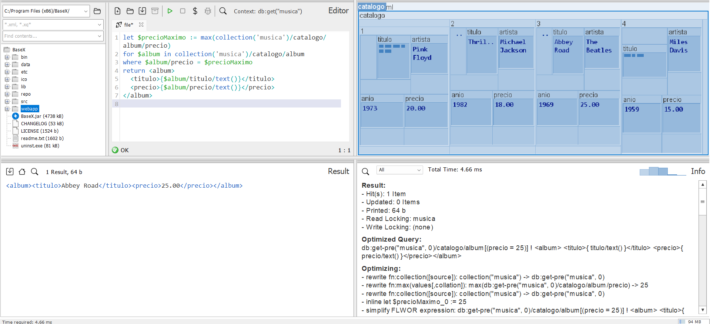
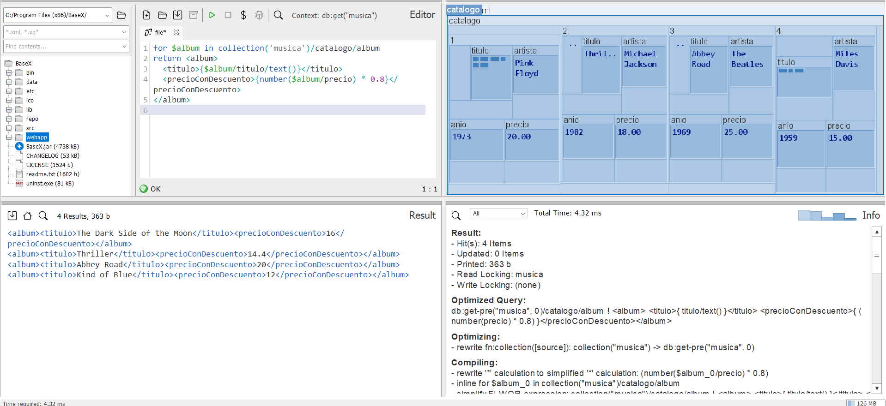
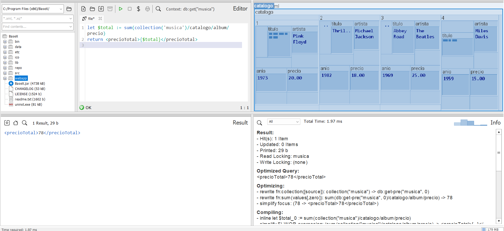

## Ejercicio 3. Archivo musica.xml:

__Pregunta 1.__ _Devuelve todos los títulos de los álbumes._

`for $album in collection('musica')/catalogo/album
return $album/titulo`

___Pregunta 2.__ _Devuelve los álbumes cuyo precio es mayor a 18._

`for $album in collection('musica')/catalogo/album
where $album/precio > 18
return <album>
  <titulo>{$album/titulo/text()}</titulo>
  <precio>{$album/precio/text()}</precio>
</album>`

__Pregunta 3.__ _Lista los títulos y géneros de todos los álbumes._

`for $album in collection('musica')/catalogo/album
return <album>
  <titulo>{$album/titulo/text()}</titulo>
  <genero>{$album/@genero}</genero>
</album>`

__Pregunta 4.__ _Calcula el precio promedio de los álbumes (usa let)._

`let $precios := collection('musica')/catalogo/album/precio
return <precioPromedio>{avg($precios)}</precioPromedio>`

__Pregunta 5.__ _Encuentra los álbumes de género "Rock"._

`for $album in collection('musica')/catalogo/album
where $album/@genero = "Rock"
return <album>
  <titulo>{$album/titulo/text()}</titulo>
  <genero>{$album/@genero}</genero>
</album>`

__Pregunta 6.__ _Ordena los álbumes por año de lanzamiento._

`for $album in collection('musica')/catalogo/album
order by $album/anio ascending
return <album>
  <titulo>{$album/titulo/text()}</titulo>
  <anio>{$album/anio/text()}</anio>
</album>`

__Pregunta 7.__ _Devuelve el álbum más caro._

`let $precioMaximo := max(collection('musica')/catalogo/album/precio)
for $album in collection('musica')/catalogo/album
where $album/precio = $precioMaximo
return <album>
  <titulo>{$album/titulo/text()}</titulo>
  <precio>{$album/precio/text()}</precio>
</album>`

__Pregunta 8.__ _Devuelve los títulos y los precios con un descuento del 20%._

`for $album in collection('musica')/catalogo/album
return <album>
  <titulo>{$album/titulo/text()}</titulo>
  <precioConDescuento>{number($album/precio) * 0.8}</precioConDescuento>
</album>`

__Pregunta 9.__ _Devuelve los álbumes lanzados antes de 1975._

`for $album in collection('musica')/catalogo/album
where $album/anio < 1975
return <album>
  <titulo>{$album/titulo/text()}</titulo>
  <anio>{$album/anio/text()}</anio>
</album>`

__Pregunta 10.__ _Calcula el precio total de todos los álbumes._

`let $total := sum(collection('musica')/catalogo/album/precio)
return <precioTotal>{$total}</precioTotal>`

