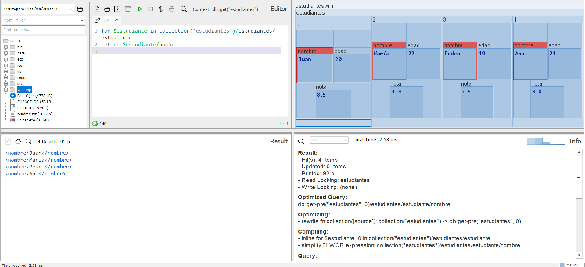
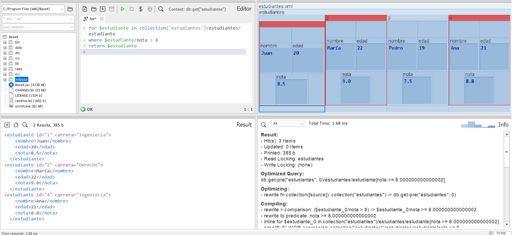
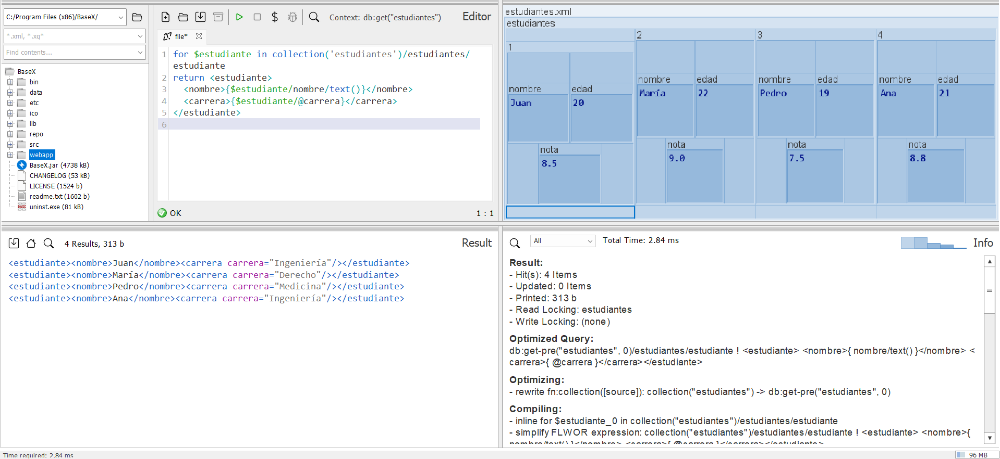
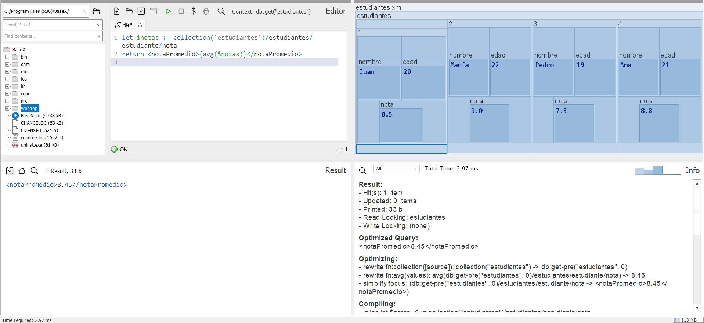
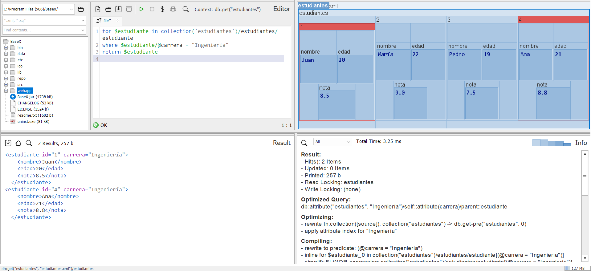
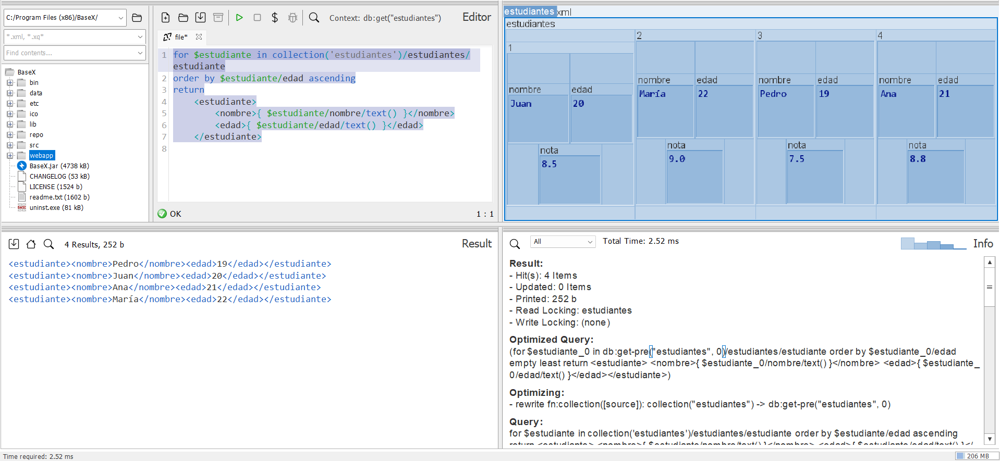
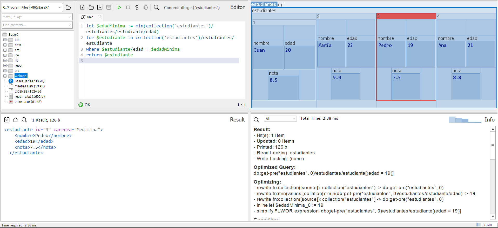
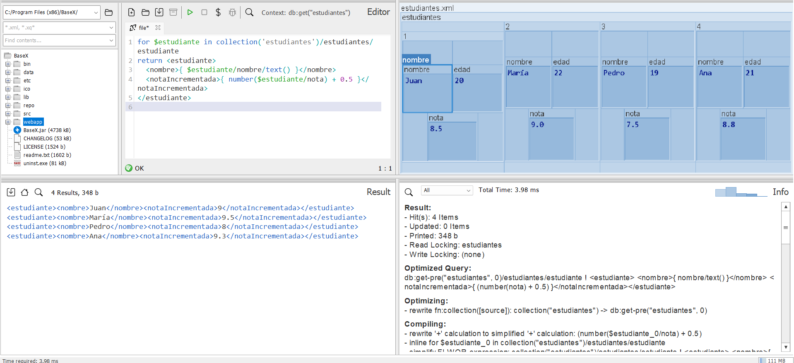
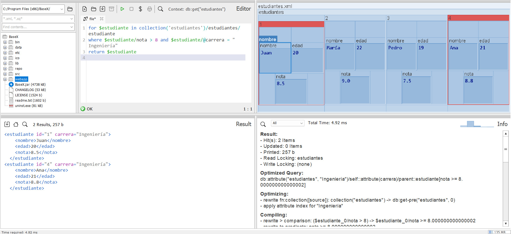
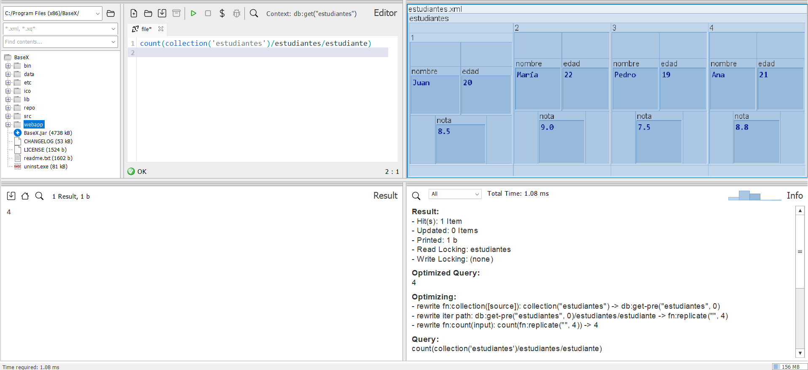

## Ejercicio 4. Archivo estudiantes.xml:

__Pregunta 1.__ _Devuelve los nombres de los estudiantes._

`for $estudiante in collection('estudiantes')/estudiantes/estudiante
return $estudiante/nombre`

__Pregunta 2.__ _Filtra los estudiantes con una nota mayor a 8._

`for $estudiante in collection('estudiantes')/estudiantes/estudiante
where $estudiante/nota > 8
return $estudiante`

__Pregunta 3.__ _Devuelve los nombres y las carreras de los estudiantes._

`for $estudiante in collection('estudiantes')/estudiantes/estudiante
return <estudiante>
  <nombre>{$estudiante/nombre/text()}</nombre>
  <carrera>{$estudiante/@carrera}</carrera>
</estudiante>`

__Pregunta 4.__ _Calcula la nota promedio de los estudiantes (usa let)._

`let $notas := collection('estudiantes')/estudiantes/estudiante/nota
return <notaPromedio>{avg($notas)}</notaPromedio>`

__Pregunta 5.__ _Devuelve los estudiantes de la carrera "Ingeniería"._

`for $estudiante in collection('estudiantes')/estudiantes/estudiante
where $estudiante/@carrera = "Ingeniería"
return $estudiante`

__Pregunta 6.__ _Ordena a los estudiantes por edad._

`for $estudiante in collection('estudiantes')/estudiantes/estudiante
order by $estudiante/edad ascending
return
    <estudiante>
        <nombre>{ $estudiante/nombre/text() }</nombre>
        <edad>{ $estudiante/edad/text() }</edad>
    </estudiante>`

__Pregunta 7.__ _Devuelve el estudiante más joven._

`let $edadMinima := min(collection('estudiantes')/estudiantes/estudiante/edad)
for $estudiante in collection('estudiantes')/estudiantes/estudiante
where $estudiante/edad = $edadMinima
return $estudiante`

__Pregunta 8.__ _Devuelve los nombres y las notas incrementadas en 0.5._

`for $estudiante in collection('estudiantes')/estudiantes/estudiante
return <estudiante>
  <nombre>{ $estudiante/nombre/text() }</nombre>
  <notaIncrementada>{ number($estudiante/nota) + 0.5 }</notaIncrementada>
</estudiante>`

__Pregunta 9.__ _Devuelve los estudiantes cuya nota es mayor a 8 y pertenecen a Ingeniería._

`for $estudiante in collection('estudiantes')/estudiantes/estudiante
where $estudiante/nota > 8 and $estudiante/@carrera = "Ingeniería"
return $estudiante`

__Pregunta 10.__ _Cuenta cuántos estudiantes hay en total._

`count(collection('estudiantes')/estudiantes/estudiante)`

