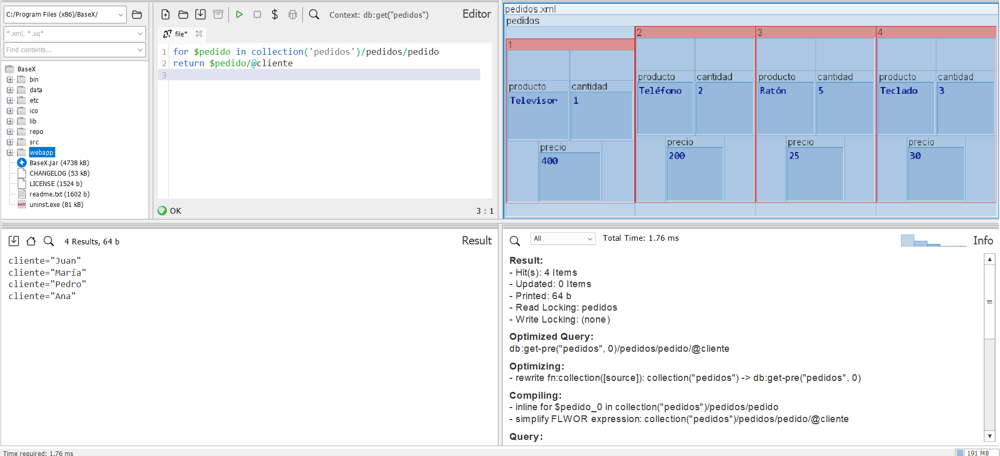
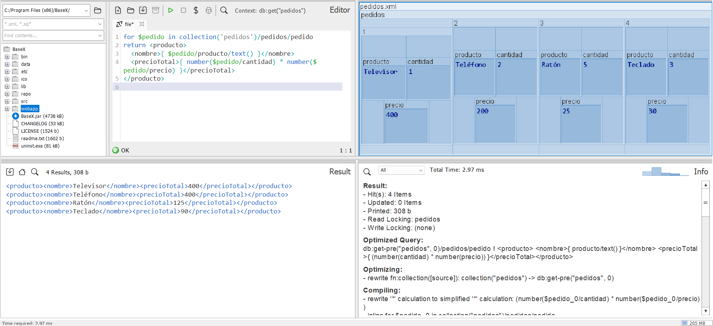
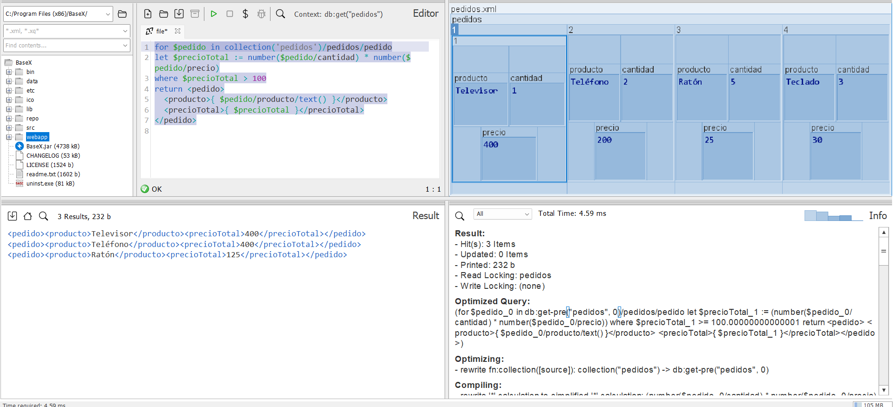
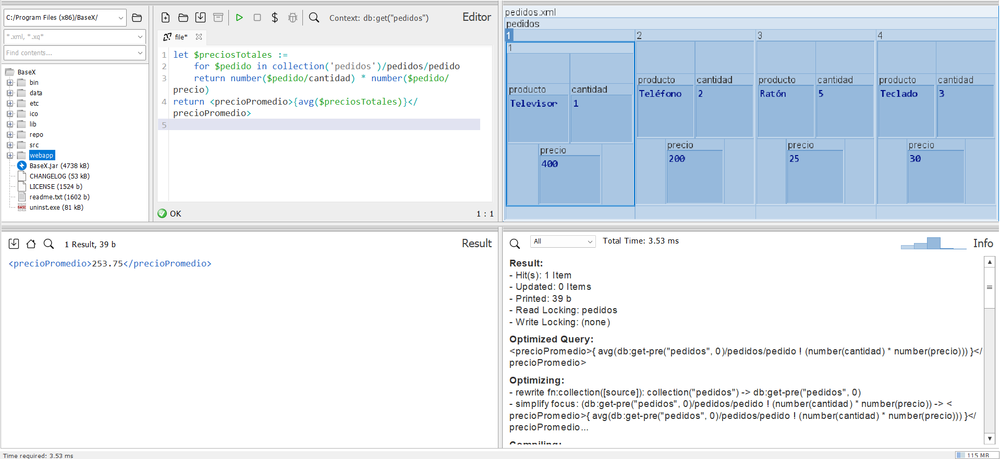
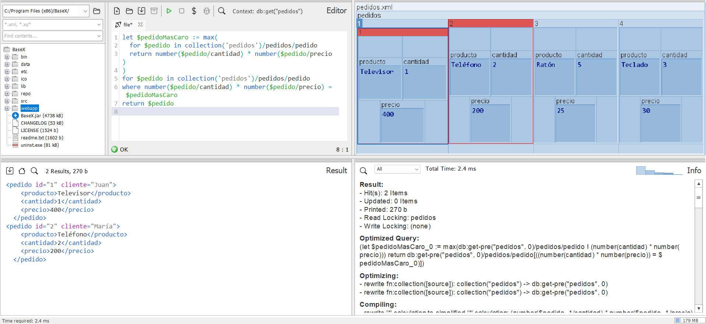
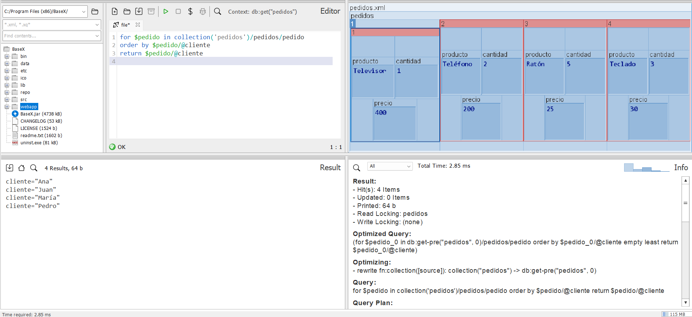
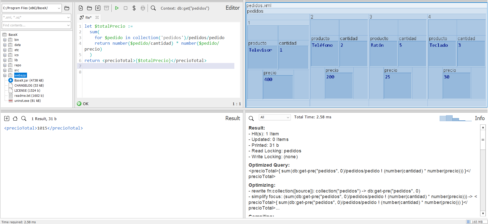
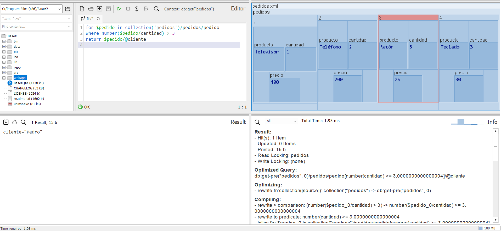
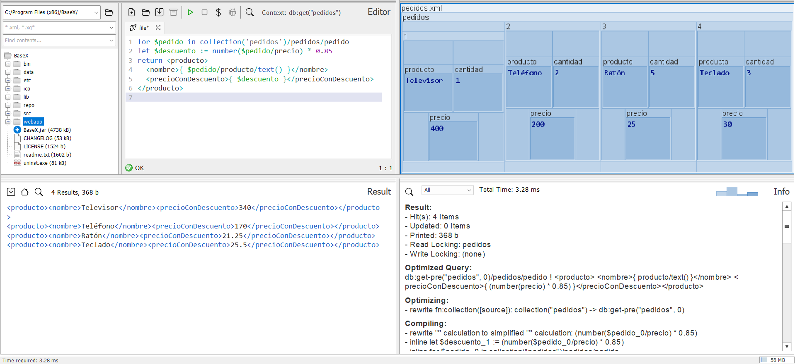
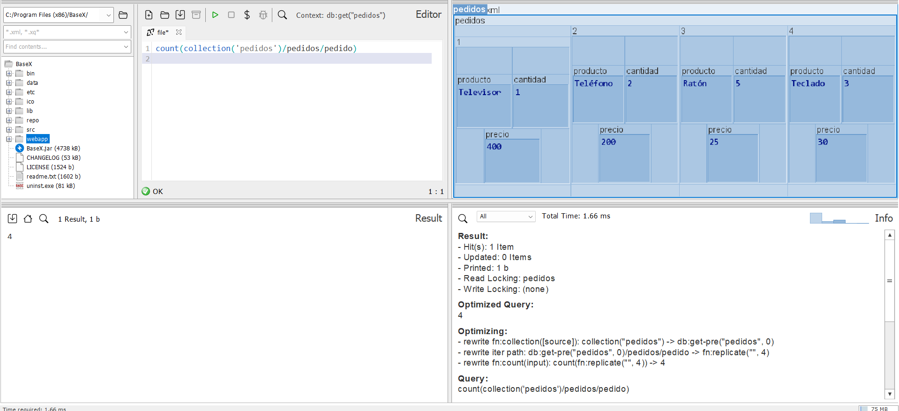

## Ejercicio 5. Archivo pedidos.xml:

__Ejercicio 1.__ _Devuelve los nombres de los clientes._

`for $pedido in collection('pedidos')/pedidos/pedido
return $pedido/@cliente`

__Ejercicio 2.__ _Devuelve los productos con precio total (cantidad × precio)._

`for $pedido in collection('pedidos')/pedidos/pedido
return <producto>
  <nombre>{ $pedido/producto/text() }</nombre>
  <precioTotal>{ number($pedido/cantidad) * number($pedido/precio) }</precioTotal>
</producto>`

__Ejercicio 3.__ _Filtra los pedidos cuyo precio total sea mayor a 100._

`for $pedido in collection('pedidos')/pedidos/pedido
let $precioTotal := number($pedido/cantidad) * number($pedido/precio)
where $precioTotal > 100
return <pedido>
  <producto>{ $pedido/producto/text() }</producto>
  <precioTotal>{ $precioTotal }</precioTotal>
</pedido>`

__Ejercicio 4.__ _Calcula el precio promedio de todos los pedidos._

`let $preciosTotales := 
    for $pedido in collection('pedidos')/pedidos/pedido
    return number($pedido/cantidad) * number($pedido/precio)
return <precioPromedio>{avg($preciosTotales)}</precioPromedio>`

__Ejercicio 5.__ _Devuelve el pedido más caro._

`let $pedidoMasCaro := max(
  for $pedido in collection('pedidos')/pedidos/pedido
  return number($pedido/cantidad) * number($pedido/precio)
)
for $pedido in collection('pedidos')/pedidos/pedido
where number($pedido/cantidad) * number($pedido/precio) = $pedidoMasCaro
return $pedido`

_Nota: devuelve dos pedidos que tienen el mismo importe total_ 

__Ejercicio 6.__ _Ordena los pedidos por cliente alfabéticamente._

`for $pedido in collection('pedidos')/pedidos/pedido
order by $pedido/@cliente
return $pedido/@cliente`

__Ejercicio 7.__ _Calcula el precio total de todos los pedidos._

`let $totalPrecio :=
  sum(
    for $pedido in collection('pedidos')/pedidos/pedido
    return number($pedido/cantidad) * number($pedido/precio)
  )
return <precioTotal>{$totalPrecio}</precioTotal>`

__Ejercicio 8.__ _Devuelve los nombres de los clientes que compraron más de 3 unidades._

`for $pedido in collection('pedidos')/pedidos/pedido
where number($pedido/cantidad) > 3
return $pedido/@cliente`

__Ejercicio 9.__ _Devuelve los productos y sus precios con un descuento del 15% (usa let)._

`for $pedido in collection('pedidos')/pedidos/pedido
let $descuento := number($pedido/precio) * 0.85
return <producto>
  <nombre>{ $pedido/producto/text() }</nombre>
  <precioConDescuento>{ $descuento }</precioConDescuento>
</producto>`

__Ejercicio 10.__ _Cuenta el número total de pedidos._

`count(collection('pedidos')/pedidos/pedido)`

