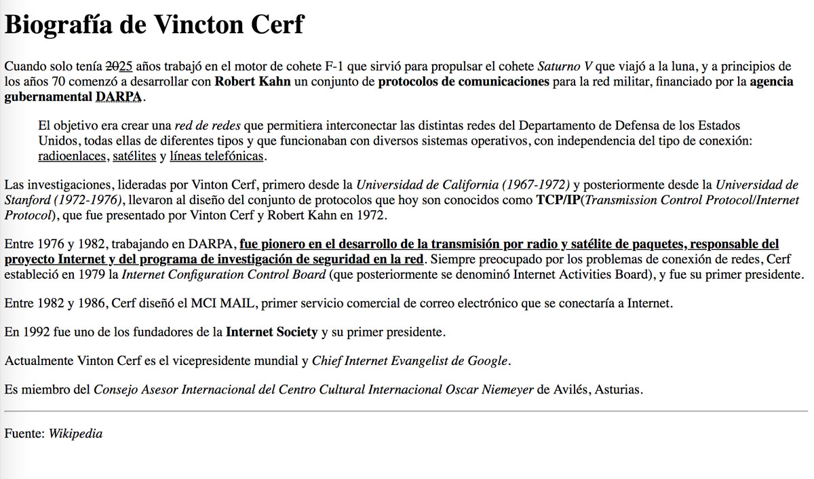

## Ejercicio 3

Dado el siguiente texto:

```
Biografía de Vincton Cerf Cuando solo tenía 25 años trabajó en el motor de cohete F-1 que sirvió para propulsar el cohete Saturno V que viajó a la luna, y a principios de los años 70 comenzó a desarrollar con Robert Kahn un conjunto de protocolos de comunicaciones para la red militar, financiado por la agencia gubernamental DARPA. El objetivo era crear una "red de redes" que permitiera interconectar las distintas redes del Departamento de Defensa de los Estados Unidos, todas ellas de diferentes tipos y que funcionaban con diversos sistemas operativos, con independencia del tipo de conexión: radioenlaces, satélites y líneas telefónicas. Las investigaciones, lideradas por Vinton Cerf, primero desde la Universidad de California (1967-1972) y posteriormente desde la Universidad de Stanford (1972-1976), llevaron al diseño del conjunto de protocolos que hoy son conocidos como TCP/IP (Transmission Control Protocol/Internet Protocol), que fue presentado por Vinton Cerf y Robert Kahn en 1972. Entre 1976 y 1982, trabajando en DARPA, fue pionero en el desarrollo de la transmisión por radio y satélite de paquetes, responsable del proyecto Internet y del programa de investigación de seguridad en la red. Siempre preocupado por los problemas de conexión de redes, Cerf estableció en 1979 la Internet Configuration Control Board (que posteriormente se denominó Internet Activities Board), y fue su primer presidente. Entre 1982 y 1986, Cerf diseñó el MCI MAIL, primer servicio comercial de correo electrónico que se conectaría a Internet. En 1992 fue uno de los fundadores de la Internet Society y su primer presidente. Actualmente Vinton Cerf es el vicepresidente mundial y Chief Internet Evangelist de Google. Es miembro del Consejo Asesor Internacional del Centro Cultural Internacional Oscar Niemeyer de Avilés, Asturias.
```

A continuación, haz que tenga el siguiente formato:



```
<!DOCTYPE html>
<html lang="es">
  <head>
    <meta charset="UTF-8">
    <title>Biografía de Vincton Cerf</title>
  </head>
  <body>
    <h1>Biografía de <strong>Vincton Cerf</strong></h1>
    <p>
      Cuando solo tenía <s>20</s><u>25</u> años trabajó en el motor de cohete F-1 que sirvió para propulsar el cohete <em>Saturno V</em> que viajó a la luna, y a principios de los años 70 comenzó a desarrollar con <strong>Robert Kahn</strong> un conjunto de <strong>protocolos de comunicaciones</strong> para la red militar, financiado por la <strong>agencia gubernamental <u>DARPA</u>.</strong>
    </p>
    <p style="margin: 30px;">
      El objetivo era crear una <em>red de redes</em> que permitiera interconectar las distintas redes del Departamento de Defensa de los Estados Unidos, todas ellas de diferentes tipos y que funcionaban con diversos sistemas operativos, con independencia del tipo de conexión: <u>radioenlaces</u>, <u>satélites</u> y <u>líneas telefónicas</u>.
    </p>
    <p>
      Las investigaciones, lideradas por Vinton Cerf, primero desde la <em>Universidad de California (1967-1972)</em> y posteriormente desde la <em>Universidad de Stanford (1972-1976)</em>, llevaron al diseño del conjunto de protocolos que hoy son conocidos como <strong>TCP/IP</strong> (Transmission Control Protocol/Internet Protocol), que fue presentado por Vinton Cerf y Robert Kahn en 1972.
    </p>
    <p>
      Entre 1976 y 1982, trabajando en DARPA,<strong><u>fue pionero en el desarrollo de la transmisión por radio y satélite de paquetes, responsable del proyecto Internet y del programa de investigación de seguridad en la red.</u></strong> Siempre preocupado por los problemas de conexión de redes, Cerf estableció en 1979 la <em>Internet Configuration Control Board</em> (que posteriormente se denominó Internet Activities Board), y fue su primer presidente.
    </p>
    <p>
      Entre 1982 y 1986, Cerf diseñó el MCI MAIL, primer servicio comercial de correo electrónico que se conectaría a Internet.
    </p>
    <p>
      En 1992 fue uno de los fundadores de la <strong>Internet Society</strong> y su primer presidente.
    </p>
    <p>
      Actualmente Vinton Cerf es el vicepresidente mundial y <em>Chief Internet Evangelist de Google.</em>
    </p>
    <p>
      Es miembro del <em>Consejo Asesor Internacional del Centro Cultural Internacional Oscar Niemeyer</em> de Avilés, Asturias.
    </p>
    <p>Fuente: <em>Wikipedia</em></p>
  </body>
</html>
```