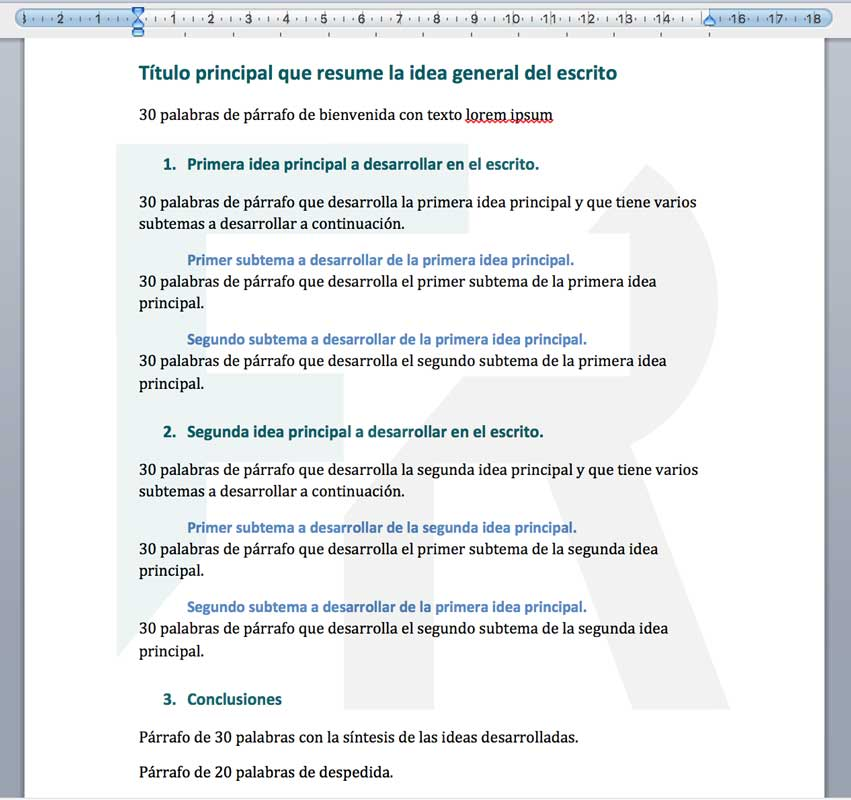

## Ejercicio 4

Dado el siguiente texto:

```
Título principal que resume la idea general del escrito
30 palabras de párrafo de bienvenida con texto lorem ipsum
Primera idea principal a desarrollar en el escrito.
30 palabras de párrafo que desarrolla la primera idea principal y que tiene varios subtemas a desarrollar a continuación.
Primer subtema a desarrollar de la primera idea principal.
30 palabras de párrafo que desarrolla el primer subtema de la primera idea principal.
Segundo subtema a desarrollar de la primera idea principal.
30 palabras de párrafo que desarrolla el segundo subtema de la primera idea principal.
Segunda idea principal a desarrollar en el escrito.
30 palabras de párrafo que desarrolla la segunda idea principal y que tiene varios subtemas a desarrollar a continuación.
Primer subtema a desarrollar de la segunda idea principal.
30 palabras de párrafo que desarrolla el primer subtema de la segunda idea principal.
Segundo subtema a desarrollar de la primera idea principal.
30 palabras de párrafo que desarrolla el segundo subtema de la segunda idea principal.
Conclusiones 
Párrafo de 30 palabras con la síntesis de las ideas desarrolladas.
Párrafo de 20 palabras de despedida.
```

A continuación, haz que tenga el siguiente formato:



```
<!DOCTYPE html>
<html lang="es">
<head>
  <meta charset="UTF-8">
  <title>Documento Formateado</title>
</head>
<body style="margin: 40px; font-family: sans-serif;">
  <h1 style="color: #007777; margin: 0; padding: 0;">
    Título principal que resume la idea general del escrito
  </h1>
  <p style="margin: 10px 0 20px 0;">
    30 palabras de párrafo de bienvenida con texto lorem ipsum
  </p>
  <h2 style="margin: 0 0 5px 65px; padding: 0;">
    <span style="color: #007777; display: inline-block; width: 30px; margin-left: -20px;">1.</span>
    <span style="color: #007777;">Primera idea principal a desarrollar en el escrito.</span>
  </h2>
  <p style="margin: 10px 0 20px 0;">
    30 palabras de párrafo que desarrolla la primera idea principal y que tiene varios subtemas a desarrollar a continuación.
  </p>
  <h3 style="margin: 0 0 5px 80px; padding: 0; color: #0055AA;">
    Primer subtema a desarrollar de la primera idea principal.
  </h3>
  <p style="margin: 10px 0 20px 0;">
    30 palabras de párrafo que desarrolla el primer subtema de la primera idea principal.
  </p>
  <h3 style="margin: 0 0 5px 80px; padding: 0; color: #0055AA;">
    Segundo subtema a desarrollar de la primera idea principal.
  </h3>
  <p style="margin: 10px 0 20px 0;">
    30 palabras de párrafo que desarrolla el segundo subtema de la primera idea principal.
  </p>
  <h2 style="margin: 0 0 5px 65px; padding: 0;">
    <span style="color: #007777; display: inline-block; width: 30px; margin-left: -20px;">2.</span>
    <span style="color: #007777;">Segunda idea principal a desarrollar en el escrito.</span>
  </h2>
  <p style="margin: 0 0 20px 0;">
    30 palabras de párrafo que desarrolla la segunda idea principal y que tiene varios subtemas a desarrollar a continuación.
  </p>
    <h3 style="margin: 0 0 5px 80px; padding: 0; color: #0055AA;">
    Primer subtema a desarrollar de la segunda idea principal.
  </h3>
  <p style="margin: 10px 0 20px 0;">
    30 palabras de párrafo que desarrolla el primer subtema de la segunda idea principal.
  </p>
    <h3 style="margin: 0 0 5px 80px; padding: 0; color: #0055AA;">
    Segundo subtema a desarrollar de la segunda idea principal.
  </h3>
  <p style="margin: 10px 0 20px 0;">
    30 palabras de párrafo que desarrolla el segundo subtema de la segunda idea principal.
  </p>
  <h2 style="margin: 0 0 5px 65px; padding: 0;">
    <span style="color: #007777; display: inline-block; width: 30px; margin-left: -20px;">3.</span>
    <span style="color: #007777;">Conclusiones</span>
  </h2>
  <p style="margin: 10px 0 20px 0;">
    Párrafo de 30 palabras con la síntesis de las ideas desarrolladas.
  </p>
  <p style="margin: 10px 0 20px 0;">
    Párrafo de 20 palabras de despedida.
  </p>
</body>
</html>
```