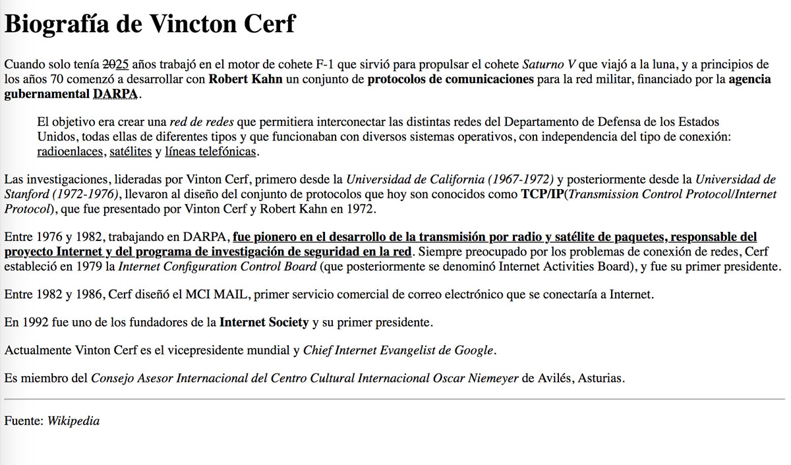

## Ejercicio 2

Dado el siguiente texto:

```
Berners-Lee trabajó en el CERN desde junio hasta diciembre de 1980. Durante ese tiempo, propuso un proyecto basado en el hipertexto para facilitar la forma de compartir y la puesta al día de la información entre investigadores. En este periodo también construyó un programa llamado ENQUIRE que no llegó a ver la luz.1​Después de dejar el CERN, en 1980, se fue a trabajar a la empresa de John Poole Image Computer Systems Ltd., pero regresó al CERN otra vez en 1984. En 1989, el CERN era el nodo de Internet más grande de Europa y Berners-Lee vio la oportunidad de unir Internet y el hipertexto (HTTP y HTML), de lo que surgiría la World Wide Web. Desarrolló su primera propuesta de la Web el 12 de marzo de 1989,2​ pero no tuvo mucho eco, por lo que en 1990 y con la ayuda de Robert Cailliau, hicieron una revisión que fue aceptada por su gerente, Mike Sendall. Usó ideas similares a las que había usado en el sistema Enquire, para crear la World Wide Web, para esto diseñó y construyó el primer navegador (llamado WorldWideWeb y desarrollado con NEXTSTEP) y el primer servidor Web al que llamó httpd (HyperText Transfer Protocol daemon). El primer servidor Web se encontraba en el CERN y fue puesto en línea el 6 de agosto de 1991. Esto proporcionó una explicación sobre lo que era el World Wide Web, cómo uno podría tener un navegador y cómo establecer un servidor Web. Este fue también el primer directorio Web del mundo, ya que Berners-Lee mantuvo una lista de otros sitios Web aparte del suyo. Debido a que tanto el software del servidor como del cliente fue liberado de forma gratuita desde el CERN, el corazón de Internet Europeo en esa época, su difusión fue muy rápida. El número de servidores Web pasó de veintiséis en 1992 a doscientos en octubre de 1995 lo que refleja cual fue la velocidad de la difusión de internet. En 1994 entró en el Laboratorio de Ciencias de la Computación e Inteligencia Artificial del Massachusetts Institute of Technology. Se trasladó a EE. UU. y puso en marcha el W3C, que dirige actualmente. El W3C es un organismo internacional de estandarización de tecnologías Web dirigido conjuntamente por el Instituto Tecnológico de Massachusetts, el ERCIM francés y la Universidad de Keiō en Japón. Este organismo decidió que todos sus estándares fuesen libres, es decir, que los pudiese utilizar todo el mundo libremente sin coste alguno, lo que sin lugar a dudas fue una de las grandes razones para que la Web haya llegado a tener la importancia que tiene hoy en día. En su libro Tejiendo la red, publicado en 1999, Berners-Lee explica por qué la tecnología web es libre y gratis. Se considera al mismo tiempo el inventor y el protector de la web.
```

A continuación, haz que tenga el siguiente formato:



```
<!DOCTYPE html>
<html lang="es">
<head>
    <meta charset="UTF-8">
    <meta name="viewport" content="width=device-width, initial-scale=1.0">
    <meta name="description" content="Biografía de Tim Berners-Lee">
    <title>Biografía de Tim Berners-Lee</title>
</head>
<body style="font-family: Times New Roman, sans-serif; margin: 20px;">
    <header>
        <h1 style="font-size: 24px; font-weight: bold;">Biografía de Tim Berners-Lee</h1>
    </header>
    <main>
        <div>
            <p><strong>Berners-Lee</strong> trabajó en el <strong>CERN</strong> desde junio hasta diciembre de 1980. Durante ese tiempo, propuso un proyecto basado en el <em>hipertexto</em> para facilitar la forma de compartir y la puesta al día de la información entre investigadores. En este periodo también construyó un programa llamado <strong><em>ENQUIRE</em></strong> que no llegó a ver la luz.</p>

            <p>Después de dejar el <strong>CERN</strong>, en 1980, se fue a trabajar a la empresa de <em>John Poole Image Computer Systems Ltd.</em>, pero regresó al CERN otra vez en 1984.</p>
            
            <h2><strong>El nacimiento de la web</strong></h2>

            <p>En 1989, el CERN era el nodo de Internet más grande de Europa y Berners-Lee vio la oportunidad de unir Internet y el hipertexto (<strong>HTTP</strong> y <strong>HTML</strong>), de lo que surgiría la <strong>World Wide Web</strong>.</p>


            <p>Desarrolló su primera propuesta de la Web el 12 de marzo de 1989, pero no tuvo mucho eco, por lo que en 1990, con la ayuda de <em>Robert Cailliau</em>, hicieron una revisión que fue aceptada por su gerente, <em>Mike Sendall</em>.</p>
            
            <p style="margin-left: 30px;">Usó ideas similares a las que había usado en el sistema <em>Enquire</em> para crear la <strong>World Wide Web</strong>, para esto diseñó y construyó el primer navegador (llamado WorldWideWeb y desarrollado con NEXTSTEP) y el primer servidor Web que llamó httpd(HyperText Transfer Protocol daemon).</p>

            <h2><strong>La democratización de la web</strong></h2>

            <p><strong>El primer servidor Web</strong> se encontraba en el CERN y fue puesto en línea el 6 de agosto de 1991. Esto proporcionó una explicación sobre lo que era la World Wide Web, cómo uno podría tener un navegador y cómo establecer un servidor Web. Este también fue el primer directorio Web del mundo, ya que Berners-Lee mantuvo una lista de otros sitios Web aparte del suyo.</p>

            <p>Debido a que tanto <strong>el software del servidor como del cliente fue liberado de forma gratuita</strong> desde el CERN, el corazón de Internet Europeo en esa época, su difusión fue muy rápida. El número de servidores Web pasó de veintiséis en 1992 a doscientos en octubre de 1995, lo que refleja cual fue la velocidad de la difusión de Internet.</p>

            <h2><strong>El nacimiento del W3C</strong></h2>

            <p>En 1994 entró en el <em>Laboratorio de Ciencias de la Computación e Inteligencia Artificial del Massachusetts Institute of Technology</em>. Se trasladó a EE. UU. y puso en marcha el <strong>W3C</strong>, que dirige actualmente.</p>

            <p style="padding-left: 30px;">El <strong>W3C</strong> es un organismo internacional de estandarización de tecnologías Web dirigido conjuntamente por el <em>Instituto Tecnológico de Massachusetts</em>, el <em>ERCIM</em> francés y la <em>Universidad de Keiō</em> en Japón. Este organismo decidió que todos sus estándares fuesen libres, es decir que los pudiese utilizar todo el mundo libremente los usara sin coste alguno, lo que sinlugar a dudas fue una de las grandes razones para que la Web haya llegado a tener la importancia que tiene hoy en día.</p>

            <p>En su libro <em>Tejiendo la red</em>, publicado en 1999, Berners-Lee explica por qué la tecnología web es <strong>libre y gratis. Se considera al mismo tiempo el inventor y el protector de la Web</strong>.</p>
        </div>
    </main>
</body>
</html>
```