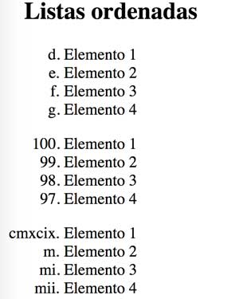

## Ejercicio 2

Escribe con HTML las listas según la imagen:



```
<!DOCTYPE html>
<html lang="es">
<head>
  <meta charset="UTF-8">
  <title>Listas ordenadas</title>
</head>
<body>
    <ol type="a" start="4">
        <li>Elemento 1</li>
        <li>Elemento 2</li>
        <li>Elemento 3</li>
        <li>Elemento 4</li>
    </ol>
    <ol reversed start="100">
        <li>Elemento 1</li>
        <li>Elemento 2</li>
        <li>Elemento 3</li>
        <li>Elemento 4</li>
    </ol>
    <ol type="i" start="999">
        <li>Elemento 1</li>
        <li>Elemento 2</li>
        <li>Elemento 3</li>
        <li>Elemento 4</li>
    </ol>
</body>
</html>
```