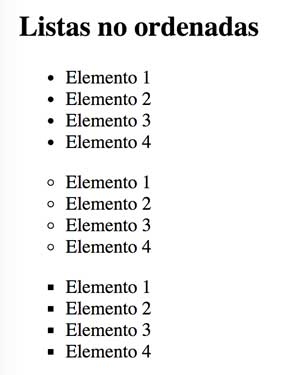

## Ejercicio 3

Escribe con HTML las listas según la imagen:



```
<!DOCTYPE html>
<html lang="es">
<head>
  <meta charset="UTF-8">
  <title>Listas no ordenadas</title>
</head>
<body>
    <ul>
        <li>Elemento 1</li>
        <li>Elemento 2</li>
        <li>Elemento 3</li>
        <li>Elemento 4</li>
    </ul>
    <ul style="list-style-type: circle;">
        <li>Elemento 1</li>
        <li>Elemento 2</li>
        <li>Elemento 3</li>
        <li>Elemento 4</li>
    </ul>
    <ul style="list-style-type: square;">
        <li>Elemento 1</li>
        <li>Elemento 2</li>
        <li>Elemento 3</li>
        <li>Elemento 4</li>
    </ul>
</body>
</html>
```