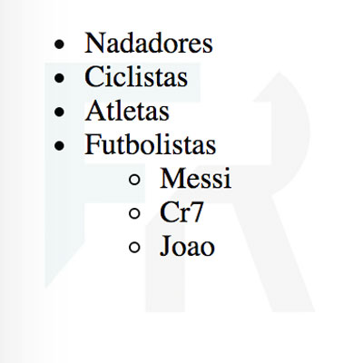

## Ejercicio 4

Escribe en HTML la lista según la imagen:



```
<!DOCTYPE html>
<html lang="es">
<head>
  <meta charset="UTF-8">
  <title>Listas no ordenadas anidadas</title>
</head>
<body>
    <ul>
        <li>Nadadores</li>
        <li>Ciclistas</li>
        <li>Atletas</li>
        <li>Futbolistas
            <ul>
                <li>Messi</li>
                <li>Cr7</li>
                <li>Joao</li>
            </ul>
        </li>
    </ul>
</body>
</html>
```
