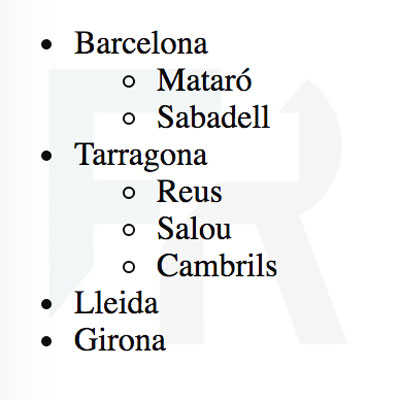

## Ejercicio 5

Escribe en HTML la lista según la imagen:



```
<!DOCTYPE html>
<html lang="es">
<head>
  <meta charset="UTF-8">
  <title>Listas no ordenadas anidadas</title>
</head>
<body>
    <ul>
        <li>Barcelona
            <ul>
                <li>Mataró</li>
                <li>Sabadell</li>
            </ul>
        </li>
        <li>Tarragona
            <ul>
                <li>Reus</li>
                <li>Salou</li>
                <li>Cambrils</li>
            </ul>
        </li>
        <li>Lleida</li>
        <li>Girona</li>
    </ul>
</body>
</html>
```
