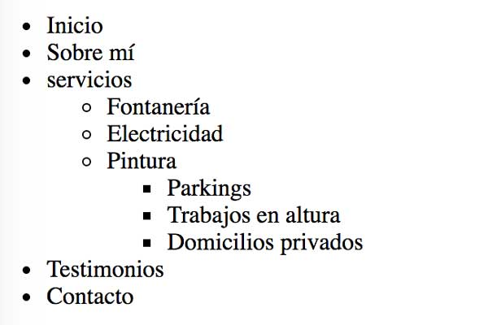

## Ejercicio 7

Escribe en HTML la lista según la imagen:



```
<!DOCTYPE html>
<html lang="es">
<head>
  <meta charset="UTF-8">
  <title>Listas no ordenadas anidadas</title>
</head>
<body>
    <ul>
        <li>Inicio</li>
        <li>Sobre mí</li>
        <li>servicios
            <ul>
                <li>Fontanería</li>
                <li>Electricidad</li>
                <li>Pintura
                    <ul>
                        <li>Parkings</li>
                        <li>Trabajos en altura</li>
                        <li>Domicilios privados</li>
                    </ul>
                </li>
            </ul>
        </li>
        <li>Testimonios</li>
        <li>Contacto</li>
    </ul>
</body>
</html>
```