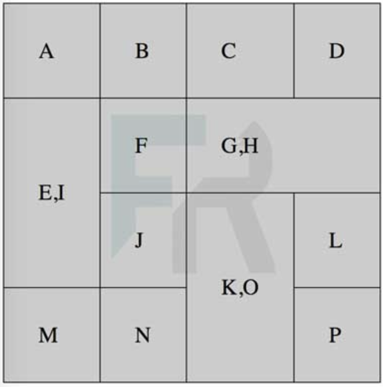

## Ejercicio 1

Crea un documento html mediante el cuál se visualize una tabla como la de la imagen. Para mejorar el estilo de la tabla, añade dentro del <head> del documento html este código:

```html
<style>
        
        table{
            border-collapse: collapse;
        }
        
        td{
            border:1px solid #000;
            padding:25px;
            background-color:#ccc;
        }
        
</style>
```



```
<!DOCTYPE html>
<html lang="es">
<head>
<meta charset="UTF-8">
<title>Tabla con rowspan y colspan</title>
<style>
    table {
        border-collapse: collapse;
    }
    td {
        border: 1px solid #000;
        padding: 25px;
        background-color: #ccc;
    }
</style>
</head>
<body>
<table>
  <tr>
    <td>A</td>
    <td>B</td>
    <td>C</td>
    <td>D</td>
  </tr>
  <tr>
    <td rowspan="2">E,I</td>
    <td>F</td>
    <td colspan="2">G,H</td>
  </tr>
  <tr>
    <td>J</td>
    <td rowspan="2">K,O</td>
    <td>L</td>
  </tr>
  <tr>
    <td>M</td>
    <td>N</td>
    <td>P</td>
  </tr>
</table>
</body>
</html>
```
