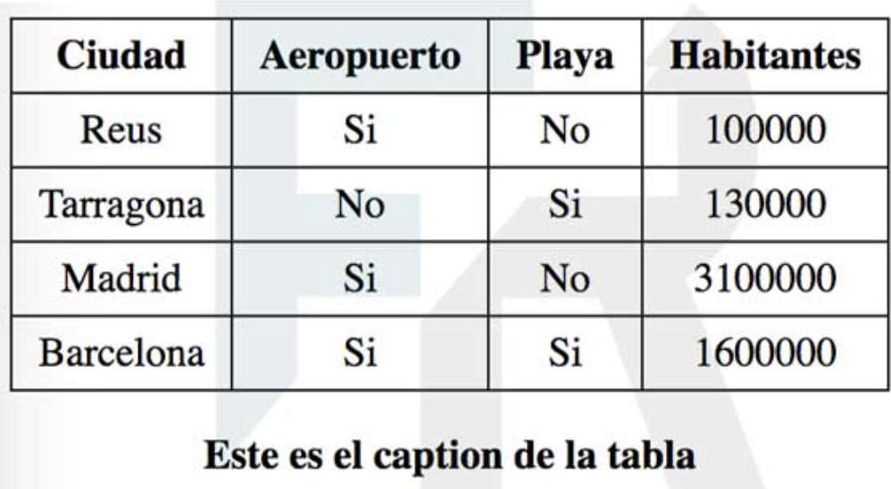

## Ejercicio 2

Dado el siguiente documento html se desea conseguir el resultado de la imagen adjunta. Para mejorar el estilo de la tabla, añade dentro del <head> del documento html este código:

```html
<style>
	table{
		border-collapse:collapse;
		caption-side: bottom;
	}
	caption{
		font-weight:bold;
		margin-top:16px;
	}
	th,td{padding:5px 10px;}
	td,th{border:1px solid #1c1c1c;text-align:center;}

</style>
```



```
<!DOCTYPE html>
<html lang="es">
<head>
  <meta charset="UTF-8">
  <title>Tabla Ejemplo</title>
  <style>
    table {
      border-collapse: collapse;
      caption-side: bottom; /* El caption se coloca debajo de la tabla */
    }
    caption {
      font-weight: bold;
      margin-top: 16px; /* Espacio entre la tabla y el caption */
    }
    th, td {
      padding: 5px 10px;
    }
    td, th {
      border: 1px solid #1c1c1c;
      text-align: center;
    }
  </style>
</head>
<body>
<table>
  <caption>Este es el caption de la tabla</caption>
  <thead>
    <tr>
      <th>Ciudad</th>
      <th>Aeropuerto</th>
      <th>Playa</th>
      <th>Habitantes</th>
    </tr>
  </thead>
  <tbody>
    <tr>
      <td>Reus</td>
      <td>Sí</td>
      <td>No</td>
      <td>100000</td>
    </tr>
    <tr>
      <td>Tarragona</td>
      <td>No</td>
      <td>Sí</td>
      <td>130000</td>
    </tr>
    <tr>
      <td>Madrid</td>
      <td>Sí</td>
      <td>No</td>
      <td>3100000</td>
    </tr>
    <tr>
      <td>Barcelona</td>
      <td>Sí</td>
      <td>Sí</td>
      <td>1600000</td>
    </tr>
  </tbody>
</table>
</body>
</html>
```