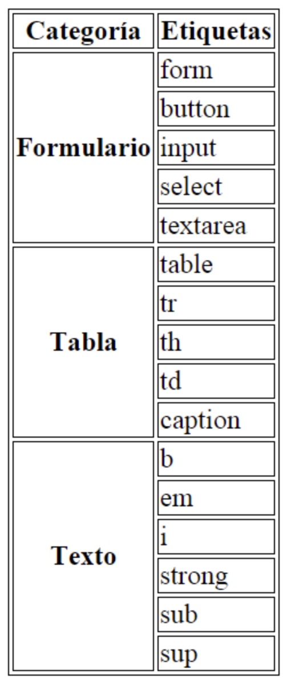

## Ejercicio 3

Crea un documento html mediante el cuál se visualize una tabla como la de la imagen. Para mejorar el estilo de la tabla, añade dentro del <head> del documento html este código:

```html
<style>
        
        table{
            border-collapse: collapse;
        }
        
        td{
            border:1px solid #000;
            padding:25px;
            background-color:#ccc;
        }
        
</style>
```

