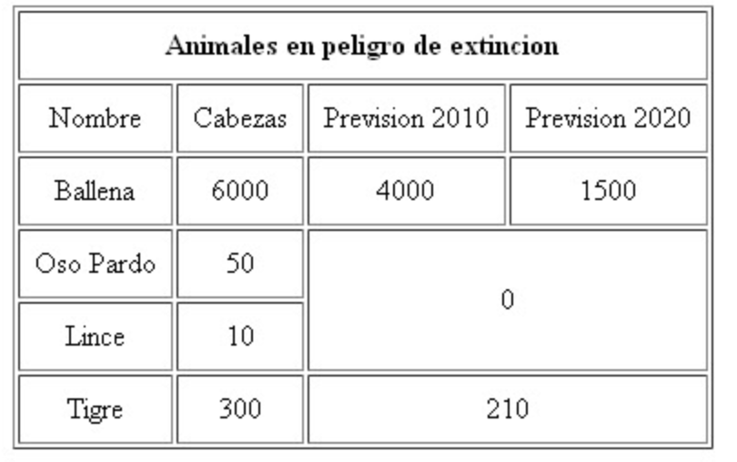

## Ejercicio 4

Crea un documento html mediante el cuál se visualize una tabla como la de la imagen.



```
<!DOCTYPE html>
<html lang="es">
<head>
  <meta charset="UTF-8">
  <title>Animales en peligro de extinción</title>
  <style>
    table {
      border: 2px solid #000;
      border-collapse: separate;
      border-spacing: 5px;
    }
    th, td {
      border: 1px solid #000;
      background-color: #fff;
      padding: 10px;
      text-align: center;
      font-weight: normal;
    }
  </style>
</head>
<body>
  <table>
    <thead>
      <tr>
        <th colspan="4"><strong>Animales en peligro de extinción</strong></th>
      </tr>
      <tr>
        <th>Nombre</th>
        <th>Cabezas</th>
        <th>Previsión 2010</th>
        <th>Previsión 2020</th>
      </tr>
    </thead>
    <tbody>
      <tr>
        <td>Ballena</td>
        <td>6000</td>
        <td>4000</td>
        <td>1500</td>
      </tr>
      <tr>
        <td>Oso Pardo</td>
        <td>50</td>
        <td colspan="2" rowspan="2">0</td>
      </tr>
      <tr>
        <td>Lince</td>
        <td>10</td>
      </tr>
      <tr>
        <td>Tigre</td>
        <td>300</td>
        <td colspan="2">210</td>
      </tr>
    </tbody>
  </table>
</body>
</html>
```
