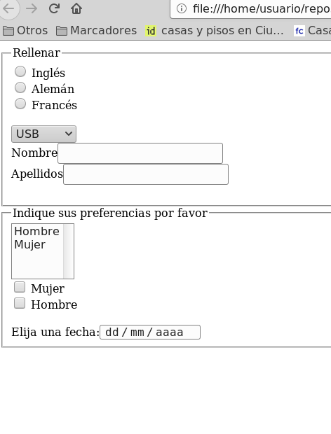

## Ejercicio 1

Crear el fichero `formularios01.html` con un formulario HTML con los siguientes requisitos:

* Contiene los siguientes radiobuttons:radio con el name «idioma» , value «idiomaingles» y el texto «Inglés», radio con el name «idioma» , value «idiomaaleman» y el texto «Alemán», radio con el name «idioma» , value «idiomafrances» y el texto «Francés».
* Hay una lista desplegable con el name «conector» y con las siguientes opciones: opción «USB» con el value usb, opción «Paralelo» con el value paralelo, opción «PS2» con el value ps2.
* Hay los siguientes cuadros de texto:cuadro de texto con el texto «Nombre» y el name nombre, cuadro de texto con el texto «Apellidos» y el name apellidos
* Hay una lista desplegable múltiple con el name «sexo» y con las siguientes opciones: opción «Hombre» con el value hombre, opción «Mujer» con el value mujer.
* Contiene los siguientes checkboxes:checkbox con el name «sexo» , value «sexomujer» y el texto «Mujer», checkbox con el name «sexo» , value «sexohombre» y el texto «Hombre».
* Hay un control para indicar la fecha.

- [Abrir formularios01.html](formularios01.html)

