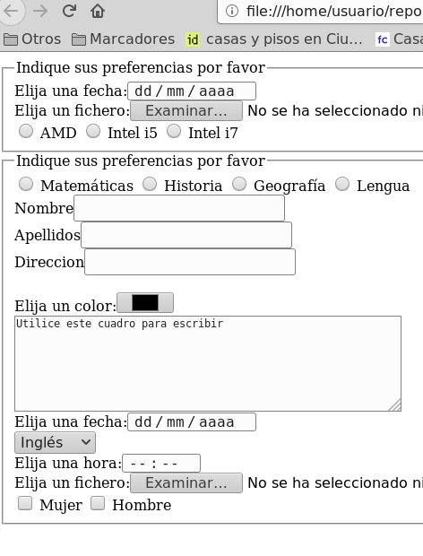

## Ejercicio 2

Crear el fichero `formularios02.html` con un formulario HTML con los siguientes requisitos:

* Hay un control para indicar la fecha.
* Hay un control para elegir ficheros.
* Contiene los siguientes radiobuttons:radio con el name «procesador» , value «procesadoramd» y el texto «AMD», radio con el name «procesador» , value «procesadorintel_i5» y el texto «Intel i5», radio con el name «procesador» , value «procesadorintel_i7» y el texto «Intel i7».
* Contiene los siguientes radiobuttons:radio con el name «asignatura» , value «asignaturamatematicas» y el texto «Matemáticas», radio con el name «asignatura» , value «asignaturahistoria» y el texto «Historia», radio con el name «asignatura» , value «asignaturageografia» y el texto «Geografía», radio con el name «asignatura» , value «asignaturalengua» y el texto «Lengua».
* Hay los siguientes cuadros de texto:cuadro de texto con el texto «Nombre» y el name nombre, cuadro de texto con el texto «Apellidos» y el name apellidos, cuadro de texto con el texto «Direccion» y el name direccion
* Hay un control para elegir el color.
* Hay un textarea que mide 6 filas y 59 columnas que lleva dentro el texto «Utilice este cuadro para escribir»
* Hay un control para indicar la fecha.
* Hay una lista desplegable con el name «idioma» y con las siguientes opciones: opción «Inglés» con el value ingles, opción «Alemán» con el value aleman, opción «Francés» con el value frances.
* Hay un control para indicar la hora.
* Hay un control para elegir ficheros.
* Contiene los siguientes checkboxes:checkbox con el name «sexo» , value «sexomujer» y el texto «Mujer», checkbox con el name «sexo» , value «sexohombre» y el texto «Hombre».

- [Abrir formularios02.html](formularios02.html)

