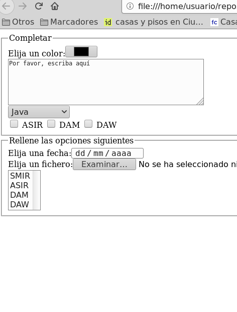

## Ejercicio 3

Crear el fichero `formularios03.html` con un formulario HTML con los siguientes requisitos:

* Hay un control para elegir el color.
* Hay un textarea que mide 5 filas y 53 columnas que lleva dentro el texto «Por favor, escriba aquí»
* Hay una lista desplegable con el name «lenguaje» y con las siguientes opciones: opción «Java» con el value java, opción «Python» con el value python, opción «HTML» con el value html, opción «Visual Basic» con el value visual_basic.
* Contiene los siguientes checkboxes:checkbox con el name «ciclo» , value «cicloasir» y el texto «ASIR», checkbox con el name «ciclo» , value «ciclodam» y el texto «DAM», checkbox con el name «ciclo» , value «ciclodaw» y el texto «DAW».
* Hay un control para indicar la fecha.
* Hay un control para elegir ficheros.
* Hay una lista desplegable múltiple con el name «ciclo» y con las siguientes opciones: opción «SMIR» con el value smir, opción «ASIR» con el value asir, opción «DAM» con el value dam, opción «DAW» con el value daw.

- [Abrir formularios03.html](formularios03.html)

