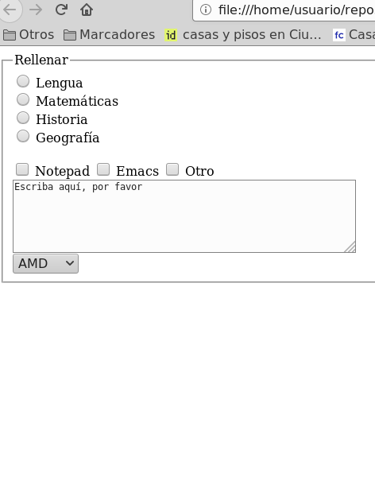

## Ejercicio 4

Crear el fichero `formularios04.html` con un formulario HTML con los siguientes requisitos:

* Generar el formulario siguiente de acuerdo a los siguientes requisitos
* Contiene los siguientes radiobuttons:radio con el name «asignatura» , value «asignaturalengua» y el texto «Lengua», radio con el name «asignatura» , value «asignaturamatematicas» y el texto «Matemáticas», radio con el name «asignatura» , value «asignaturahistoria» y el texto «Historia», radio con el name «asignatura» , value «asignaturageografia» y el texto «Geografía».
* Contiene los siguientes checkboxes:checkbox con el name «editor» , value «editornotepad» y el texto «Notepad», checkbox con el name «editor» , value «editoremacs» y el texto «Emacs», checkbox con el name «editor» , value «editorotro» y el texto «Otro».
* Hay un textarea que mide 5 filas y 59 columnas que lleva dentro el texto «Escriba aquí, por favor»
* Hay una lista desplegable con el name «procesador» y con las siguientes opciones: opción «AMD» con el value amd, opción «Intel i5» con el value intel_i5, opción «Intel i7» con el value intel_i7.

- [Abrir formularios04.html](formularios04.html)

