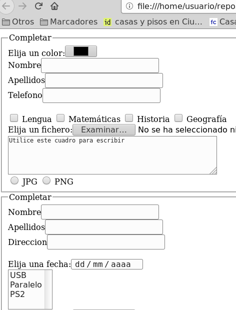

## Ejercicio 5

Crear el fichero `formulario05.html` con un formulario HTML con los siguientes requisitos:

* Hay un control para elegir el color.
* Hay los siguientes cuadros de texto:cuadro de texto con el texto «Nombre» y el name nombre, cuadro de texto con el texto «Apellidos» y el name apellidos, cuadro de texto con el texto «Telefono» y el name telefono
* Contiene los siguientes checkboxes:checkbox con el name «asignatura» , value «asignaturalengua» y el texto «Lengua», checkbox con el name «asignatura» , value «asignaturamatematicas» y el texto «Matemáticas», checkbox con el name «asignatura» , value «asignaturahistoria» y el texto «Historia», checkbox con el name «asignatura» , value «asignaturageografia» y el texto «Geografía».
* Hay un control para elegir ficheros.
* Hay un textarea que mide 4 filas y 57 columnas que lleva dentro el texto «Utilice este cuadro para escribir»
* Contiene los siguientes radiobuttons:radio con el name «formato» , value «formatojpg» y el texto «JPG», radio con el name «formato» , value «formatopng» y el texto «PNG».
* Hay los siguientes cuadros de texto:cuadro de texto con el texto «Nombre» y el name nombre, cuadro de texto con el texto «Apellidos» y el name apellidos, cuadro de texto con el texto «Direccion» y el name direccion
* Hay un control para indicar la fecha.
* Hay una lista desplegable múltiple con el name «conector» y con las siguientes opciones: opción «USB» con el value usb, opción «Paralelo» con el value paralelo, opción «PS2» con el value ps2.
* Hay un control para elegir ficheros.
  
  - [Abrir formularios05.html](formularios05.html)

