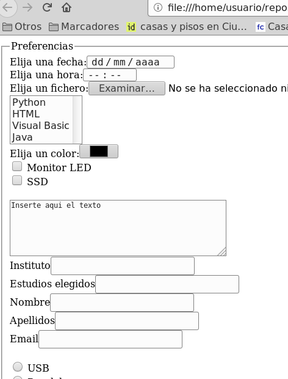

## Ejercicio 6

Crear el fichero `formularios06.html` con un formulario HTML con los siguientes requisitos:

* Generar el formulario siguiente de acuerdo a los siguientes requisitos
* Hay un control para indicar la fecha.
* Hay un control para indicar la hora.
* Hay un control para elegir ficheros.
* Hay una lista desplegable múltiple con el name «lenguaje» y con las siguientes opciones: opción «Python» con el value python, opción «HTML» con el value html, opción «Visual Basic» con el value visual_basic, opción «Java» con el value java.
* Hay un control para elegir el color.
* Contiene los siguientes checkboxes:checkbox con el name «hardware» , value «hardwaremonitor_led» y el texto «Monitor LED», checkbox con el name «hardware» , value «hardwaressd» y el texto «SSD».
* Hay un textarea que mide 5 filas y 48 columnas que lleva dentro el texto «Inserte aqui el texto»
* Hay los siguientes cuadros de texto:cuadro de texto con el texto «Instituto» y el name instituto, cuadro de texto con el texto «Estudios elegidos» y el name estudios, cuadro de texto con el texto «Nombre» y el name nombre, cuadro de texto con el texto «Apellidos» y el name apellidos, cuadro de texto con el texto «Email» y el name email
* Contiene los siguientes radiobuttons:radio con el name «conector» , value «conectorusb» y el texto «USB», radio con el name «conector» , value «conectorparalelo» y el texto «Paralelo», radio con el name «conector» , value «conectorps2» y el texto «PS2».

  - [Abrir formularios06.html](formularios06.html)

